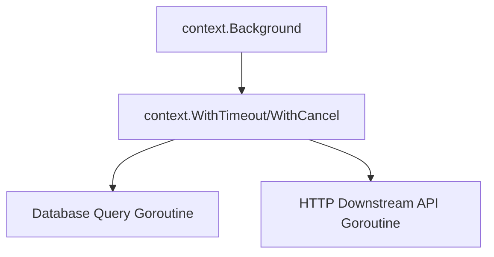

# Go Concurrency & Best Practices

Concurrency is one of Go’s most defining and powerful features. Unlike traditional languages that rely heavily on operating system threads and explicit lock-based synchronization, Go is designed around the **CSP (Communicating Sequential Processes)** model. It makes concurrent programming easier to reason about, highly performant, and safer at scale.

This guide deep dives into the mechanics of Go's concurrency primitives, scheduling model, synchronization packages, design patterns, and critical safety practices to prevent race conditions and leaks.

---

## 1. The CSP Model: Channels over Shared Memory

Traditional concurrency (e.g., in C++, Java, or Python) typically relies on **shared memory and locks**. Multiple threads access the same variables, and developers use mutexes, semaphores, and barriers to prevent threads from modifying the same data simultaneously. This approach is notorious for:
- Deadlocks (threads waiting on each other indefinitely).
- Data races (unsynchronized concurrent memory access).
- Complexity in maintaining lock hierarchies.

Go implements **Communicating Sequential Processes (CSP)**, a model formalized by C.A.R. Hoare in 1978. Go’s slogan sums it up:

> "Do not communicate by sharing memory; instead, share memory by communicating."

Instead of using locks to guard access to shared variables, Go uses **Channels** to pass data (and ownership of that data) between independent execution flows called **Goroutines**.

---

## 2. Goroutines Under the Hood

A **Goroutine** is a lightweight thread of execution managed by the Go runtime, not the Operating System.

### OS Threads vs. Goroutines

| Feature | OS Thread | Goroutine |
| :--- | :--- | :--- |
| **Managed By** | Operating System Kernel | Go Runtime Scheduler |
| **Memory Footprint** | Large (typically 1MB to 8MB guard stack) | Very small (starts at 2KB, grows/shrinks dynamically) |
| **Creation/Teardown** | Expensive (requires syscalls to the kernel) | Cheap (allocated on user-space heap) |
| **Context Switch Cost** | Slow (requires kernel transition, saving/restoring CPU registers) | Fast (user-space scheduling, ~10-100ns, ~14 registers saved) |
| **Communication** | Difficult (requires shared memory, locks, IPC) | Easy & Native (using Channels) |

### The Go Runtime Scheduler (The M:P:N Model)

The Go runtime uses an **M:P:N scheduler** to multiplex $N$ goroutines onto $M$ operating system threads using $P$ logical processors:

- **G (Goroutine)**: Represents the goroutine itself, its stack, program counter, and status.
- **M (Machine / OS Thread)**: Represents a physical OS thread managed by the OS scheduler.
- **P (Processor)**: Represents a logical processor or resource required to execute Go code. The number of $P$ defaults to the number of logical CPU cores (`runtime.GOMAXPROCS`).

```mermaid
graph TD
    subgraph Go Runtime Scheduler
        P1[Processor P1] -->|runs on| M1[OS Thread M1]
        P2[Processor P2] -->|runs on| M2[OS Thread M2]
        
        P1 -->|Local Run Queue| G1[Goroutine G1]
        G1 --> G2[Goroutine G2]
        G1 --> G3[Goroutine G3]
        
        P2 -->|Local Run Queue| G4[Goroutine G4]
        G4 --> G5[Goroutine G5]
    end
    
    GQ[(Global Run Queue)] -.->|if local queue empty| P1
    GQ -.->|if local queue empty| P2
```



#### Work Stealing and Syscall Handling
1. **Work Stealing**: If a processor $P$ runs out of goroutines in its local run queue, it tries to steal half the goroutines from another processor's local run queue. If those are empty, it checks the global run queue.
2. **Syscall Handoff**: When a goroutine $G$ makes a blocking system call (like file I/O), the Go scheduler detaches the OS thread $M$ from processor $P$ so the remaining goroutines on $P$ can continue executing on a different thread. Once the syscall completes, $G$ is placed back on an available queue.

---

## 3. Channels in Detail

Channels are typed, thread-safe pipelines through which you can send and receive values.

### Unbuffered vs. Buffered Channels

```go
// Unbuffered channel (synchronous)
ch := make(chan int)

// Buffered channel with capacity 3 (asynchronous up to capacity)
chBuf := make(chan int, 3)
```

- **Unbuffered Channels**: Sending to an unbuffered channel blocks the sender until a receiver reads from it. Receiving blocks the receiver until a sender writes to it. This guarantees direct synchronization between goroutines.
- **Buffered Channels**: Sending only blocks when the buffer is full. Receiving only blocks when the buffer is empty.

### Channel Directionality

To write safer APIs, you can restrict channels to be send-only or receive-only in function signatures:

```go
// chan<- int is a send-only channel
func produce(ch chan<- int) {
    ch <- 42
}

// <-chan int is a receive-only channel
func consume(ch <-chan int) {
    val := <-ch
    fmt.Println(val)
}
```

### The Channel Lifecycle State Table

Working with closed or nil channels can trigger runtime panics or hang indefinitely. You must memorize this table:

| Channel State | Operation | Resulting Behavior |
| :--- | :--- | :--- |
| **`nil`** (uninitialized) | `<- ch` (Receive) | **Blocks indefinitely** |
| | `ch <- val` (Send) | **Blocks indefinitely** |
| | `close(ch)` | **Panics**: `panic: close of nil channel` |
| **Open & Valid** | `<- ch` (Receive) | Blocks if empty; returns value if elements present |
| | `ch <- val` (Send) | Blocks if full; inserts value if space present |
| | `close(ch)` | Closes the channel; broadcasts to all waiting receivers |
| **Closed** | `<- ch` (Receive) | Non-blocking. Returns zero-value of type immediately once empty. |
| | `ch <- val` (Send) | **Panics**: `panic: send on closed channel` |
| | `close(ch)` | **Panics**: `panic: close of closed channel` |

> [!IMPORTANT]
> **Who should close a channel?**
> A general rule of thumb is: **Always close a channel from the sender side, never from the receiver side.** If you close a channel on the receiver side, a sender trying to write to it later will cause a panic.

#### The "Comma, OK" Idiom for Receives
Since reading from a closed channel returns the zero-value, you need a way to distinguish between a zero-value that was sent vs. a closed channel:

```go
val, ok := <-ch
if !ok {
    fmt.Println("Channel is closed and drained!")
}
```

---

## 4. Multiplexing with `select`

The `select` statement lets a goroutine wait on multiple communication operations. It blocks until one of its cases can run, then executes that case. If multiple are ready, it chooses one pseudo-randomly.

```go
package main

import (
    "fmt"
    "time"
)

func main() {
    ch1 := make(chan string)
    ch2 := make(chan string)

    go func() {
        time.Sleep(1 * time.Second)
        ch1 <- "one"
    }()
    go func() {
        time.Sleep(2 * time.Second)
        ch2 <- "two"
    }()

    for i := 0; i < 2; i++ {
        select {
        case msg1 := <-ch1:
            fmt.Println("Received from ch1:", msg1)
        case msg2 := <-ch2:
            fmt.Println("Received from ch2:", msg2)
        }
    }
}
```

### Timeouts using `select`
Without a timeout, a channel receive could block your application forever. You can combine `select` with `time.After`:

```go
select {
case res := <-ch:
    fmt.Println("Result:", res)
case <-time.After(500 * time.Millisecond):
    fmt.Println("Timeout! Operation took too long.")
}
```

### Non-Blocking Operations
By adding a `default` case, `select` becomes non-blocking. If no channel operation is ready, the default executes immediately:

```go
select {
case msg := <-ch:
    fmt.Println("Received:", msg)
default:
    fmt.Println("No message available, moving on...")
}
```

---

## 5. Synchronization Primitives (`sync` package)

While channels are preferred for orchestrating data flows, Go's `sync` package provides low-level primitives for shared state management and performance optimizations.

### `sync.WaitGroup`

Used to wait for a collection of goroutines to finish executing.

```go
package main

import (
    "fmt"
    "sync"
    "time"
)

func worker(id int, wg *sync.WaitGroup) {
    defer wg.Done() // Decrements counter by 1 when worker exits
    fmt.Printf("Worker %d starting...\n", id)
    time.Sleep(time.Second)
    fmt.Printf("Worker %d done!\n", id)
}

func main() {
    var wg sync.WaitGroup

    for i := 1; i <= 3; i++ {
        wg.Add(1) // Increments counter by 1
        go worker(i, &wg) // Pass pointer to wg!
    }

    wg.Wait() // Blocks until counter becomes 0
    fmt.Println("All workers finished.")
}
```

> [!CAUTION]
> Always pass `sync.WaitGroup` by **pointer** to functions. If you pass it by value, the function gets a copy of the WaitGroup struct, which duplicates the internal counter, causing a deadlock when `wg.Wait()` is called in `main`.

### `sync.Mutex` and `sync.RWMutex`

- **`sync.Mutex` (Mutual Exclusion)**: Guarantees that only one goroutine can access a critical section of code at a time.
- **`sync.RWMutex` (Reader/Writer Mutex)**: Allows multiple readers to access a resource simultaneously, but only a single writer. This is highly optimized for read-heavy workloads.

```go
type SafeCounter struct {
    mu    sync.RWMutex
    value map[string]int
}

func (c *SafeCounter) Get(key string) int {
    c.mu.RLock()         // Multiple readers can hold RLock concurrently
    defer c.mu.RUnlock()
    return c.value[key]
}

func (c *SafeCounter) Set(key string, val int) {
    c.mu.Lock()          // Only one writer can hold Lock; blocks readers/writers
    defer c.mu.Unlock()
    c.value[key] = val
}
```

### `sync.Once`

Guarantees that a function is executed exactly once across the lifecycle of the program, even if called concurrently from thousands of goroutines. This is commonly used for lazy initialization or singleton patterns.

```go
var once sync.Once
var dbConnection *Database

func GetInstance() *Database {
    once.Do(func() {
        dbConnection = initializeDatabase() // Executed exactly once
    })
    return dbConnection
}
```

### `sync.Pool`

A thread-safe cache of temporary objects that can be reused individually to reduce the pressure on the garbage collector (GC). It is widely used in high-performance networking libraries (like `fasthttp` or `zap` logger).

```go
var bufPool = sync.Pool{
    New: func() interface{} {
        return make([]byte, 1024) // Created only when Pool is empty
    },
}

func process() {
    buf := bufPool.Get().([]byte) // Retrieve from pool (recycled or new)
    defer bufPool.Put(buf)        // Put back into pool when finished
    
    // Perform operations with buf...
}
```

---

## 6. Context Control (`context` package)

In Go, the `context` package is the standard way to signal cancellations, deadlines, and propagate request-scoped metadata through call stacks and goroutine chains.



### Key Context Primitives

- `context.Background()`: Returns an empty, non-nil context. Typically used at the root level of incoming requests.
- `context.WithCancel(parent)`: Returns a copy of parent with a new `Done` channel closed when the returned `cancel` function is called.
- `context.WithTimeout(parent, duration)`: Automatically calls cancel when the timeout duration expires.

### Example: Cancelling Concurrency via Timeout

```go
package main

import (
    "context"
    "fmt"
    "time"
)

func slowAPI(ctx context.Context) (string, error) {
    ch := make(chan string, 1)

    go func() {
        time.Sleep(2 * time.Second) // Simulate expensive database/network call
        ch <- "API Success Data"
    }()

    select {
    case res := <-ch:
        return res, nil
    case <-ctx.Done():
        return "", ctx.Err() // ctx.Err() returns context.Canceled or context.DeadlineExceeded
    }
}

func main() {
    // Set a timeout of 1 second
    ctx, cancel := context.WithTimeout(context.Background(), 1*time.Second)
    defer cancel() // Good practice to release resources

    data, err := slowAPI(ctx)
    if err != nil {
        fmt.Println("Failed:", err) // Prints: Failed: context deadline exceeded
    } else {
        fmt.Println("Success:", data)
    }
}
```

---

## 7. Concurrency Design Patterns

### The Worker Pool Pattern

Worker pools limit the number of goroutines running concurrently, preventing system resource exhaustion when processing thousands of tasks.

```go
package main

import (
    "fmt"
    "sync"
    "time"
)

func worker(id int, jobs <-chan int, results chan<- int, wg *sync.WaitGroup) {
    defer wg.Done()
    for job := range jobs {
        fmt.Printf("Worker %d processing job %d\n", id, job)
        time.Sleep(500 * time.Millisecond) // Simulate processing time
        results <- job * 2
    }
}

func main() {
    const numJobs = 5
    const numWorkers = 3

    jobs := make(chan int, numJobs)
    results := make(chan int, numJobs)
    var wg sync.WaitGroup

    // Start workers
    for w := 1; w <= numWorkers; w++ {
        wg.Add(1)
        go worker(w, jobs, results, &wg)
    }

    // Send jobs
    for j := 1; j <= numJobs; j++ {
        jobs <- j
    }
    close(jobs) // Mark no more jobs; workers will exit loop once drained

    // Wait for workers in background and close results
    go func() {
        wg.Wait()
        close(results)
    }()

    // Collect results
    for result := range results {
        fmt.Println("Result:", result)
    }
}
```

### Fan-Out / Fan-In

- **Fan-Out**: Multiple goroutines read from the same channel until it's closed, distributing task loads.
- **Fan-In**: A single goroutine multiplexes inputs from multiple channels into a single output stream.

```go
func fanIn(ch1, ch2 <-chan string) <-chan string {
    out := make(chan string)
    go func() {
        for {
            select {
            case msg, ok := <-ch1:
                if ok { out <- msg }
            case msg, ok := <-ch2:
                if ok { out <- msg }
            }
        }
    }()
    return out
}
```

---

## 8. Safety, Debugging, and Best Practices

Writing concurrent code introduces unique bugs. Here is how to keep your systems resilient.

### 1. Preventing Goroutine Leaks
A goroutine leak occurs when a goroutine is created but is blocked indefinitely waiting on a channel or mutex, preventing it from being garbage collected. Over time, memory usage grows until the system crashes.

#### Anti-pattern: Blocking Sender
```go
func querySomething() string {
    ch := make(chan string) // Unbuffered channel
    go func() {
        ch <- doSlowWork()  // Blocks forever if receiver is gone!
    }()
    
    // If we exit early due to some condition:
    if errorCondition {
        return "" // The goroutine above is leaked forever!
    }
    return <-ch
}
```
#### Fix: Use a Buffered Channel or Context
```go
func querySomethingSafe(ctx context.Context) string {
    ch := make(chan string, 1) // Buffer size 1 prevents sender block
    go func() {
        ch <- doSlowWork()
    }()
    
    select {
    case res := <-ch:
        return res
    case <-ctx.Done():
        return "" // Goroutine does not leak; it writes to buffer and exits
    }
}
```

### 2. Detecting Data Races (`go test -race`)
A **data race** happens when two goroutines access the same memory location concurrently, and at least one of the accesses is a write.

Go includes a built-in race detector compiler tool. **Always run your tests and binary builds with the race detector enabled in development and CI environments:**

```bash
# Run unit tests with race detection
go test -race ./...

# Build binary with race detection
go build -race -o myapp main.go
```

> [!WARNING]
> Do not run race-detector binaries in production. The race detector increases memory usage by 5x to 10x and execution overhead by 2x to 10x.

### 3. Avoiding Deadlocks
A deadlock occurs when a set of goroutines are blocked waiting for each other to release resources or send data.

```go
// Deadlock Example (locks acquired in different orders)
// Goroutine A locks Mutex 1, then Mutex 2
// Goroutine B locks Mutex 2, then Mutex 1
```

**Rule for Mutexes**: If you acquire multiple locks, always acquire them in the exact same order in all goroutines.

### 4. Handling Panics in Goroutines
If a goroutine experiences a panic that is not recovered *inside* that goroutine, it will crash the entire Go application. A panic in a spawned goroutine cannot be recovered by `recover()` in the spawning thread (e.g., `main`).

```go
// Anti-pattern: Application Crash
go func() {
    panic("something went wrong") // Crashes the entire app!
}()
```

#### Fix: Always defer a recover inside your goroutines:
```go
go func() {
    defer func() {
        if r := recover(); r != nil {
            log.Printf("Recovered from panic inside goroutine: %v", r)
        }
    }()
    
    // Dangerous logic here...
    panic("something went wrong") 
}()
```
