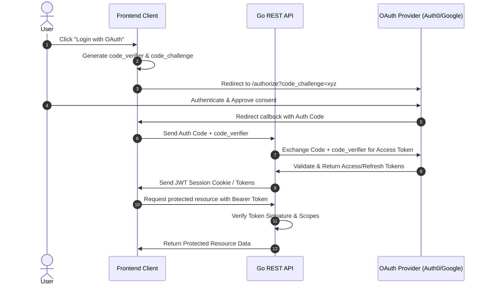

# Go REST API with OAuth 2.0

Implementing secure authentication and authorization is a cornerstone of modern API development. In a microservices or decoupled client-server architecture, **OAuth 2.0** combined with **JSON Web Tokens (JWT)** is the industry standard.

This guide covers implementing an OAuth 2.0 client and resource server in Go, showing you how to authenticate users via an OAuth 2.0 provider, issue/verify JWT tokens, and secure your REST endpoints using custom middleware.

---

## 1. Core OAuth 2.0 Concepts

Before looking at code, it's crucial to understand the roles and token types defined in the OAuth 2.0 specification (RFC 6749):

### The Four Roles
| Role | Definition | Example in our App |
| :--- | :--- | :--- |
| **Resource Owner** | The user who grants access to a protected resource. | The end user logging into your app. |
| **Client** | The application making protected requests on behalf of the owner. | Your Frontend SPA or Mobile App. |
| **Authorization Server** | The server that authenticates the owner and issues tokens. | GitHub, Auth0, Keycloak, or Google. |
| **Resource Server** | The server hosting the protected data, accepting access tokens. | Your Go REST API. |

### Token Typology
* **Access Token**: A credential used by the client to access the resource server. Usually formatted as a JWT containing scopes, audience, and expiration.
* **Refresh Token**: A long-lived credential used to request new access tokens when they expire without requiring user re-authentication.
* **ID Token**: (OIDC specific) A JWT containing information about the authenticated user (e.g., email, name).

---

## 2. Authorization Flow with PKCE

For public clients (like Single Page Applications or Mobile Apps) and backend REST APIs, the **Authorization Code Flow with Proof Key for Code Exchange (PKCE)** is the most secure flow. It prevents interception attacks by requiring the client to prove its identity using a dynamically generated cryptographic secret (`code_verifier`).



---

## 3. Project Structure

Following the idiomatic Go folder structure, we isolate our authentication domain from our transport layer:

```text
my-oauth-api/
├── cmd/
│   └── api/
│       └── main.go           # Server entry point and DI wiring
├── internal/
│   ├── auth/
│   │   ├── handler.go        # HTTP handlers for login and callbacks
│   │   ├── oauth.go          # OAuth2 configuration and exchange logic
│   │   └── token.go          # JWT parsing and validation logic
│   ├── middleware/
│   │   └── auth.go           # Authentication middleware to guard routes
│   └── server/
│       └── routes.go         # API router configuration
├── go.mod
└── go.sum
```

---

## 4. Step-by-Step Implementation

### Step 1: OAuth2 Configuration (`internal/auth/oauth.go`)

We will use the official `golang.org/x/oauth2` package. It provides helpers to build authentication URLs and exchange authorization codes for access tokens.

```go
package auth

import (
	"context"
	"errors"
	"golang.org/x/oauth2"
	"golang.org/x/oauth2/google" // Example using Google, can be swapped
	"os"
)

// Authenticator wraps the oauth2.Config to manage authentication flows.
type Authenticator struct {
	Config *oauth2.Config
}

// NewAuthenticator initializes the OAuth2 client config from environment variables.
func NewAuthenticator() (*Authenticator, error) {
	clientID := os.Getenv("OAUTH2_CLIENT_ID")
	clientSecret := os.Getenv("OAUTH2_CLIENT_SECRET")
	redirectURL := os.Getenv("OAUTH2_REDIRECT_URL")

	if clientID == "" || clientSecret == "" || redirectURL == "" {
		return nil, errors.New("missing required OAuth2 environment variables")
	}

	config := &oauth2.Config{
		ClientID:     clientID,
		ClientSecret: clientSecret,
		RedirectURL:  redirectURL,
		Endpoint:     google.Endpoint, // Swappable with Keycloak, Auth0, GitHub, etc.
		Scopes:       []string{"openid", "profile", "email"},
	}

	return &Authenticator{Config: config}, nil
}

// GetLoginURL generates the authorization endpoint redirect URL.
// The 'state' string protects against CSRF attacks.
func (a *Authenticator) GetLoginURL(state string, opts ...oauth2.AuthCodeOption) string {
	return a.Config.AuthCodeURL(state, opts...)
}

// ExchangeCode exchanges the authorization code returned by the provider for tokens.
func (a *Authenticator) ExchangeCode(ctx context.Context, code string, opts ...oauth2.AuthCodeOption) (*oauth2.Token, error) {
	return a.Config.Exchange(ctx, code, opts...)
}
```

---

### Step 2: JWT Parsing and Cryptographic Verification (`internal/auth/token.go`)

When a client makes a request to your API, they present their access token in the `Authorization: Bearer <Token>` header. Your resource server must parse this token, verify its signature, and extract scopes.

```go
package auth

import (
	"errors"
	"fmt"
	"os"
	"time"

	"github.com/golang-jwt/jwt/v5"
)

// CustomClaims represents the structure of the JWT claims we care about.
type CustomClaims struct {
	Email string   `json:"email"`
	Roles []string `json:"roles"`
	Scope string   `json:"scope"`
	jwt.RegisteredClaims
}

// TokenValidator handles parsing and validating JWT access tokens.
type TokenValidator struct {
	jwtSecret []byte
}

func NewTokenValidator() *TokenValidator {
	return &TokenValidator{
		jwtSecret: []byte(os.Getenv("JWT_SECRET")),
	}
}

// ValidateAccessToken parses and validates the JWT, ensuring it has not expired.
func (v *TokenValidator) ValidateAccessToken(tokenStr string) (*CustomClaims, error) {
	// Parse the token with our claims structure
	token, err := jwt.ParseWithClaims(tokenStr, &CustomClaims{}, func(token *jwt.Token) (interface{}, error) {
		// Validate the signing method is HMAC (HS256)
		if _, ok := token.Method.(*jwt.SigningMethodHMAC); !ok {
			return nil, fmt.Errorf("unexpected signing method: %v", token.Header["alg"])
		}
		return v.jwtSecret, nil
	})

	if err != nil {
		return nil, fmt.Errorf("token validation failed: %w", err)
	}

	claims, ok := token.Claims.(*CustomClaims)
	if !ok || !token.Valid {
		return nil, errors.New("invalid token claims")
	}

	// Verify expiration time
	if claims.ExpiresAt != nil && claims.ExpiresAt.Before(time.Now()) {
		return nil, errors.New("token has expired")
	}

	return claims, nil
}
```

> [!NOTE]
> For external identity providers (like Auth0 or Keycloak), instead of a shared static symmetric key (`JWT_SECRET`), you typically use **JWKS (JSON Web Key Sets)**. You pull public RSA keys dynamically from the provider's `.well-known/jwks.json` endpoint and use those to verify asymmetric signatures (`RS256`).

---

### Step 3: Auth Handler Implementation (`internal/auth/handler.go`)

The handlers manage the initiation of the flow, state tracking, and the callback endpoint that receives the authorization code.

```go
package auth

import (
	"crypto/rand"
	"encoding/base64"
	"encoding/json"
	"net/http"
	"time"

	"golang.org/x/oauth2"
)

type Handler struct {
	authenticator *Authenticator
}

func NewHandler(auth *Authenticator) *Handler {
	return &Handler{authenticator: auth}
}

// HandleLogin redirects the user to the OAuth2 provider login portal.
func (h *Handler) HandleLogin(w http.ResponseWriter, r *http.Request) {
	// 1. Generate CSRF state token
	state, err := generateRandomString(32)
	if err != nil {
		http.Error(w, "Internal server error", http.StatusInternalServerError)
		return
	}

	// 2. Store state in a secure short-lived cookie to verify during callback
	cookie := &http.Cookie{
		Name:     "oauth_state",
		Value:    state,
		Path:     "/",
		Expires:  time.Now().Add(10 * time.Minute),
		HttpOnly: true,
		Secure:   true, // Set true in production (requires HTTPS)
		SameSite: http.SameSiteLaxMode,
	}
	http.SetCookie(w, cookie)

	// 3. (Optional) For PKCE, generate and store code_verifier, and pass code_challenge
	// For simplicity, we demonstrate standard authorization code flow below:
	redirectURL := h.authenticator.GetLoginURL(state)
	http.Redirect(w, r, redirectURL, http.StatusTemporaryRedirect)
}

// HandleCallback processes the redirect back from the OAuth2 provider.
func (h *Handler) HandleCallback(w http.ResponseWriter, r *http.Request) {
	// 1. Validate CSRF state matching
	stateCookie, err := r.Cookie("oauth_state")
	if err != nil || r.FormValue("state") != stateCookie.Value {
		http.Error(w, "Invalid state parameter (CSRF detected)", http.StatusBadRequest)
		return
	}

	// Clear the state cookie
	http.SetCookie(w, &http.Cookie{
		Name:     "oauth_state",
		Value:    "",
		Path:     "/",
		MaxAge:   -1,
		HttpOnly: true,
	})

	// 2. Exchange code for real access token
	code := r.FormValue("code")
	if code == "" {
		http.Error(w, "Code parameter missing", http.StatusBadRequest)
		return
	}

	token, err := h.authenticator.ExchangeCode(r.Context(), code)
	if err != nil {
		http.Error(w, "Failed to exchange token: "+err.Error(), http.StatusInternalServerError)
		return
	}

	// 3. Return response with access token details or generate your own session
	w.Header().Set("Content-Type", "application/json")
	json.NewEncoder(w).Encode(map[string]interface{}{
		"access_token":  token.AccessToken,
		"token_type":    token.TokenType(),
		"expiry":        token.Expiry,
		"refresh_token": token.RefreshToken,
	})
}

// Helper: Secure random string generator
func generateRandomString(length int) (string, error) {
	bytes := make([]byte, length)
	if _, err := rand.Read(bytes); err != nil {
		return "", err
	}
	return base64.URLEncoding.EncodeToString(bytes)[:length], nil
}
```

---

### Step 4: Access Middleware (`internal/middleware/auth.go`)

The middleware intercepts requests to protected endpoints, parses the bearer token, validates it, and saves claims context to the request.

```go
package middleware

import (
	"context"
	"net/http"
	"strings"

	"my-oauth-api/internal/auth"
)

type contextKey string
const ClaimsKey contextKey = "claims"

type AuthMiddleware struct {
	validator *auth.TokenValidator
}

func NewAuthMiddleware(val *auth.TokenValidator) *AuthMiddleware {
	return &AuthMiddleware{validator: val}
}

// RequireToken guarantees the client presents a valid Access Token in Authorization header.
func (m *AuthMiddleware) RequireToken(next http.Handler) http.Handler {
	return http.HandlerFunc(w http.ResponseWriter, r *http.Request) {
		authHeader := r.Header.Get("Authorization")
		if authHeader == "" {
			http.Error(w, "Authorization header required", http.StatusUnauthorized)
			return
		}

		// Header format MUST be: "Bearer <token>"
		parts := strings.Split(authHeader, " ")
		if len(parts) != 2 || strings.ToLower(parts[0]) != "bearer" {
			http.Error(w, "Authorization header format must be Bearer <token>", http.StatusUnauthorized)
			return
		}

		tokenStr := parts[1]
		claims, err := m.validator.ValidateAccessToken(tokenStr)
		if err != nil {
			http.Error(w, "Unauthorized: "+err.Error(), http.StatusUnauthorized)
			return
		}

		// Inject verified claims into the request context
		ctx := context.WithValue(r.Context(), ClaimsKey, claims)
		next.ServeHTTP(w, r.WithContext(ctx))
	})
}

// RequireScope verifies that the claims context contains the required scope.
func RequireScope(requiredScope string) func(http.Handler) http.Handler {
	return func(next http.Handler) http.Handler {
		return http.HandlerFunc(w http.ResponseWriter, r *http.Request) {
			claims, ok := r.Context().Value(ClaimsKey).(*auth.CustomClaims)
			if !ok {
				http.Error(w, "Forbidden: No token payload", http.StatusForbidden)
				return
			}

			// Validate if required scope is present in the scope string
			scopes := strings.Split(claims.Scope, " ")
			hasScope := false
			for _, s := range scopes {
				if s == requiredScope {
					hasScope = true
					break
				}
			}

			if !hasScope {
				http.Error(w, "Forbidden: Insufficient scope permissions", http.StatusForbidden)
				return
			}

			next.ServeHTTP(w, r)
		}
	}
}
```

---

### Step 5: Connecting Handlers and Middlewares (`cmd/api/main.go`)

Now, wire the authenticator, validator, middleware, and route handlers into our web application.

```go
package main

import (
	"encoding/json"
	"log"
	"net/http"
	"os"

	"my-oauth-api/internal/auth"
	"my-oauth-api/internal/middleware"
)

func main() {
	// Ensure configurations are present
	if os.Getenv("JWT_SECRET") == "" {
		log.Fatal("JWT_SECRET environment variable is required")
	}

	// 1. Initialize core authenticators and validators
	authenticator, err := auth.NewAuthenticator()
	if err != nil {
		log.Fatalf("Failed to initialize authenticator: %v", err)
	}

	validator := auth.NewTokenValidator()
	authMiddleware := middleware.NewAuthMiddleware(validator)
	authHandler := auth.NewHandler(authenticator)

	// 2. Setup Multiplexer / Router
	mux := http.NewServeMux()

	// Public Auth Routes
	mux.HandleFunc("/auth/login", authHandler.HandleLogin)
	mux.HandleFunc("/auth/callback", authHandler.HandleCallback)

	// Protected Resource Routes (Guarded by Middleware)
	protectedMux := http.NewServeMux()
	protectedMux.HandleFunc("/api/v1/profile", func(w http.ResponseWriter, r *http.Request) {
		// Retrieve stored claims from Context
		claims := r.Context().Value(middleware.ClaimsKey).(*auth.CustomClaims)

		w.Header().Set("Content-Type", "application/json")
		json.NewEncoder(w).Encode(map[string]interface{}{
			"message": "Access granted to user profile!",
			"email":   claims.Email,
			"roles":   claims.Roles,
		})
	})

	// Wrap specific resources with custom scopes requirements
	adminRoute := http.HandlerFunc(func(w http.ResponseWriter, r *http.Request) {
		w.Write([]byte("Admin area - highly sensitive data!"))
	})
	protectedMux.Handle("/api/v1/admin", middleware.RequireScope("admin:write")(adminRoute))

	// Register standard require token verification wrapper
	mux.Handle("/api/v1/", authMiddleware.RequireToken(protectedMux))

	log.Println("Server is running on port 8080...")
	if err := http.ListenAndServe(":8080", mux); err != nil {
		log.Fatalf("Server failed: %v", err)
	}
}
```

---

## 5. Security Best Practices

When deploying OAuth 2.0 implementations in production, adhere to these security mandates:

### 1. Enforce HTTPS
OAuth 2.0 relies entirely on TLS. Without HTTPS, access tokens sent via `Authorization` headers are visible to anyone on the network path.

### 2. Guard the State Parameter
The state parameter in authorization requests is a cryptographically secure random string that acts as an anti-CSRF token.
> [!IMPORTANT]
> Always verify that the state parameter returned in the callback matches the state originally stored in the user's session cookie. Reject callbacks with mismatched states immediately.

### 3. Implement Token Expiration (Short Access Lifespans)
Access tokens should be short-lived (e.g., 15 minutes to 1 hour). Use refresh tokens with longer expirations (e.g., days or weeks) to issue new access tokens. Store refresh tokens securely in database storage or as encrypted, `HttpOnly` and `SameSite` cookies.

### 4. PKCE for Client Applications
Even if your backend performs standard Authorization Code exchange, mobile, desktop, and single-page apps must use PKCE (`code_challenge` / `code_verifier`). In Go, use oauth2 library config overrides to pass challenge query parameters.

### 5. Always Validate JWT Signatures and Standard Claims
Ensure you do not trust JWT content without verifying:
1. **Signature**: Verify signature matches the shared secret or key retrieved from JWKS.
2. **Expiration (`exp`)**: Check that the current time is before the expiration.
3. **Audience (`aud`)**: Confirm the token was intended for your specific API.
4. **Issuer (`iss`)**: Ensure the token was issued by your trusted Identity Provider.
