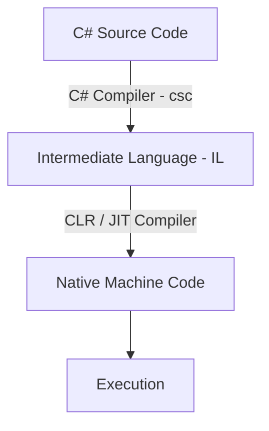

# C# Core Concepts

C# is a modern, object-oriented, and type-safe programming language developed by Microsoft that runs on the .NET platform. It is designed for building a wide range of secure and robust applications.

---

## The .NET Runtime & Compilation

C# code is not compiled directly into machine code. Instead, it follows a two-step compilation process:

1. **Compilation to IL**: The C# compiler (`csc`) compiles the source code into **Common Intermediate Language (CIL)** (or simply **IL**) and generates an assembly (an `.exe` or `.dll` file).
2. **Just-In-Time (JIT) Compilation**: When the application runs, the **Common Language Runtime (CLR)** compiles the IL into native machine code using the JIT compiler.



> [!NOTE]
> The **CLR (Common Language Runtime)** is the virtual machine component of .NET that manages the execution of .NET programs, providing services like memory management (Garbage Collection), type safety, exception handling, and thread management.

---

## Common Type System (CTS)

C# features a unified type system where all types ultimately inherit from `System.Object`. Types are divided into two main categories: **Value Types** and **Reference Types**.

| Feature | Value Types | Reference Types |
| :--- | :--- | :--- |
| **Storage** | Stack (or inline in objects on the heap) | Heap (variable holds reference/pointer on the stack) |
| **Memory Allocation** | Allocated/deallocated automatically | Managed by the Garbage Collector |
| **Default Value** | Numerical zero, `false`, or structural equivalents | `null` |
| **Copy Behavior** | Copy-by-value (duplicates the actual data) | Copy-by-reference (duplicates the reference) |
| **Examples** | `int`, `double`, `bool`, `char`, `struct`, `enum` | `string`, `class`, `interface`, `delegate`, `array` |

### Value Types vs. Reference Types Code Example

```csharp
// Value Type Example
int a = 10;
int b = a; // Copy-by-value
b = 20;
Console.WriteLine(a); // Outputs 10

// Reference Type Example
class Person { public string Name { get; set; } }

Person p1 = new Person { Name = "Alice" };
Person p2 = p1; // Copy-by-reference (points to same object)
p2.Name = "Bob";
Console.WriteLine(p1.Name); // Outputs "Bob"
```

---

## Object-Oriented Programming (OOP) in C#

C# is a class-based, object-oriented language. It supports the four main pillars of OOP: encapsulation, inheritance, polymorphism, and abstraction.

### Classes vs. Structs vs. Records

C# offers multiple constructs to define custom data structures, each optimized for different use cases:

* **Class**: Reference type. Best for stateful objects with behavior and hierarchy.
* **Struct**: Value type. Best for small, lightweight, immutable data structures.
* **Record**: Reference or Value type (via `record struct`). Introduced in C# 9, records are designed for immutable data models, offering built-in value-based equality out of the box.

```csharp
// Record declaration (C# 9+)
public record User(string Username, string Email);

// Usage:
var user1 = new User("raenard", "raenard@example.com");
var user2 = new User("raenard", "raenard@example.com");

// Value-based equality
Console.WriteLine(user1 == user2); // Outputs True

// Non-destructive mutation (with-expression)
var updatedUser = user1 with { Email = "newemail@example.com" };
```

### Interfaces and Abstract Classes

* **Abstract Class**: Can define both implementation details and abstract members. Supports single inheritance.
* **Interface**: Defines a contract without implementing state. A class or struct can implement multiple interfaces.

> [!TIP]
> Since C# 8.0, interfaces can include **Default Interface Members** (methods with bodies), allowing you to evolve interfaces without breaking existing implementations.

---

## Memory Management & The Garbage Collector

The .NET Garbage Collector (GC) manages the allocation and release of memory for your application. It operates on a **Generational** model:

* **Generation 0**: Short-lived objects (e.g., temporary variables). GC runs here most frequently.
* **Generation 1**: Buffer zone for objects transitioning from Gen 0 to Gen 2.
* **Generation 2**: Long-lived objects (e.g., static data, application-wide services).

### Disposing of Unmanaged Resources

The GC does not manage unmanaged resources (e.g., database connections, file handles, network sockets). To clean these up, implement the `IDisposable` interface and use the `using` statement or declaration:

```csharp
// Modern 'using' declaration (C# 8.0+)
using var reader = new StreamReader("file.txt");
string content = reader.ReadToEnd();
// 'reader' is automatically disposed when it goes out of scope.
```

---

## Modern C# Features

### Language Integrated Query (LINQ)

LINQ provides a unified syntax to query and manipulate collections (SQL databases, XML, memory lists) directly in C#.

```csharp
List<int> numbers = new List<int> { 1, 2, 3, 4, 5, 6, 7, 8, 9, 10 };

// Query syntax
var evenNumbersQuery = from num in numbers
                       where num % 2 == 0
                       select num;

// Method syntax (Preferred / More common)
var evenNumbersMethod = numbers.Where(num => num % 2 == 0);
```

### Pattern Matching

Pattern matching provides powerful syntax to test values and extract information in a type-safe way.

```csharp
public static double GetArea(object shape) => shape switch
{
    Circle c => Math.PI * c.Radius * c.Radius,
    Rectangle r when r.Width == r.Height => r.Width * r.Width, // Guard clause
    Rectangle r => r.Width * r.Height,
    null => throw new ArgumentNullException(nameof(shape)),
    _ => throw new ArgumentException("Unknown shape", nameof(shape))
};
```

### Asynchronous Programming (Async/Await)

C# uses the Task-based Asynchronous Pattern (TAP) to write responsive, non-blocking code.

```csharp
public async Task<string> FetchDataAsync(string url)
{
    using HttpClient client = new HttpClient();
    // Non-blocking wait for the download to complete
    string result = await client.GetStringAsync(url);
    return result;
}
```
