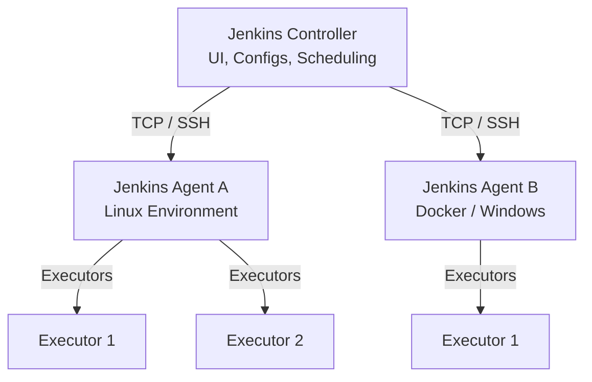

# Jenkins Core Concepts & Terminologies

A comprehensive reference guide to understanding the architecture, workflows, syntax, and key terminologies of Jenkins automation server.

---

## Architecture & Core Infrastructure

Jenkins uses a distributed, controller-agent architecture to scale workloads, isolate build environments, and delegate execution tasks.



### 1. Jenkins Controller (formerly Master)
The central management unit of the Jenkins installation. It handles:
*   The web dashboard/UI.
*   Configuring and managing build jobs and pipelines.
*   Scheduling builds and orchestrating execution.
*   Storing configurations, credentials, plugins, and build logs.

### 2. Jenkins Agent (formerly Slave / Node)
A machine (physical server, VM, or Docker container) that connects to the Jenkins controller and executes the actual build steps. Agents are lightweight and allow Jenkins to scale horizontally by running tasks in parallel across multiple OS platforms.

### 3. Executor
A slot for execution of work defined by a step or job on a node. A node can have one or more executors. The number of executors defines the concurrency limit for that node (i.e., how many tasks it can run simultaneously).

### 4. Workspace
A dedicated directory on the agent file system where Jenkins checks out source code and runs build tasks. Workspaces are isolated per job and are typically cleaned up or reused across builds.

---

## Pipeline Concepts

Jenkins Pipelines are suites of plugins that support implementing and integrating continuous delivery pipelines into Jenkins. They are defined via a `Jenkinsfile` stored in source control (Pipeline-as-Code).

### 1. Declarative vs. Scripted Pipelines
Jenkins offers two syntaxes to write pipelines:

| Feature | Declarative Pipeline | Scripted Pipeline |
| :--- | :--- | :--- |
| **Complexity** | Strict, structured, and opinionated syntax. | Flexible, imperative, program-like syntax. |
| **Language** | Subset of Groovy with predefined blocks. | Full Groovy language features. |
| **Error Handling** | Structured `post` blocks. | Groovy `try-catch-finally` blocks. |
| **Suitability** | Best for standard CI/CD workflows. | Best for highly customized, complex flows. |

### 2. Stages and Steps
*   **Stage**: A block defining a conceptually distinct subset of tasks in the pipeline (e.g., "Build", "Test", or "Deploy"). Stages visualize progress on the Jenkins dashboard.
*   **Step**: A single task inside a stage. A step tells Jenkins what to do at a particular point in time (e.g., running a shell command, checking out code, or archiving artifacts).

---

## Anatomy of a Declarative Pipeline

Below is a typical Declarative `Jenkinsfile` showing key structural elements.

```groovy
pipeline {
    agent any // Defines where the pipeline or individual stages execute

    environment {
        APP_NAME = 'my-web-app'
        DEPLOY_ENV = 'staging'
    }

    stages {
        stage('Checkout') {
            steps {
                echo 'Checking out source code...'
                checkout scm
            }
        }

        stage('Build') {
            steps {
                echo "Building application: ${APP_NAME}..."
                sh 'npm install'
                sh 'npm run build'
            }
        }

        stage('Test') {
            steps {
                echo 'Running automated tests...'
                sh 'npm run test'
            }
        }

        stage('Deploy') {
            when {
                branch 'main' // Only executes on the main branch
            }
            steps {
                echo "Deploying to ${DEPLOY_ENV}..."
                // Deployment commands
            }
        }
    }

    post {
        always {
            cleanWs() // Clean the workspace folder after the build finishes
        }
        success {
            echo 'Pipeline completed successfully!'
        }
        failure {
            echo 'Pipeline failed. Sending alerts...'
        }
    }
}
```

### Key Declarative Directive Explanations
*   `pipeline`: The outer wrapper that defines the entire Jenkins pipeline.
*   `agent`: Instructs Jenkins where to run the pipeline. Can be set to `any`, `none`, or specify a specific node label or Docker container.
*   `environment`: A block to declare global or stage-specific environment variables.
*   `stages`: Contains all the stage blocks that form the sequential pipeline.
*   `when`: Conditional block to control whether a stage runs depending on conditions (like branch names, environment variables, etc.).
*   `post`: Defines actions to execute at the end of a pipeline or stage, conditionally based on the build status (`success`, `failure`, `always`, `unstable`, `aborted`).

---

## Glossary of Jenkins Terms

| Term | Description |
| :--- | :--- |
| **Job / Project** | A user-configured task that Jenkins performs. It can be a simple Freestyle project, a structured Pipeline, or a Multibranch Pipeline. |
| **Multibranch Pipeline** | A pipeline that automatically discovers branches in Git (or other VCS) and dynamically builds them if a `Jenkinsfile` is present. |
| **Plugin** | An extension package that adds functionality to Jenkins. Jenkins has a rich ecosystem of thousands of plugins for integrating tools (Docker, AWS, Git, Slack, etc.). |
| **Credentials** | Secure data stored in Jenkins (e.g., passwords, SSH keys, API tokens, files) to allow jobs to safely authenticate with external services. |
| **Trigger / Webhook** | An event that starts a build. This can be configured on a schedule (cron), triggered manually, or triggered automatically by external webhooks (e.g., Git push / PR). |
| **Artifact** | A file generated during a build (e.g., a `.jar` package, a zip archive, or test reports) that is archived in Jenkins for downloads or subsequent stages. |
| **Downstream / Upstream** | An upstream job is a job that triggers another job. A downstream job is a job triggered by another job. |

---

## Best Practices & Guidelines

> [!TIP]
> **Pipeline-as-Code**: Always store your pipeline definition in a `Jenkinsfile` in version control (Git) rather than configuring pipelines directly in the Jenkins web UI. This makes pipelines auditable, versionable, and reusable.

> [!IMPORTANT]
> **Secret Handling**: Never hardcode credentials, passwords, or API tokens in your `Jenkinsfile`. Always use the Jenkins Credentials Store and bind them in your pipeline using the `withCredentials` block or environment bindings.

> [!WARNING]
> **Avoid Heavy Logic in Groovy**: While scripted pipelines allow full programming logic, try to keep your pipeline logic simple. Complex logic, extensive calculations, or heavy scripts should be extracted into external shell/bash scripts or wrapper tools to keep the `Jenkinsfile` clean and maintainable.
