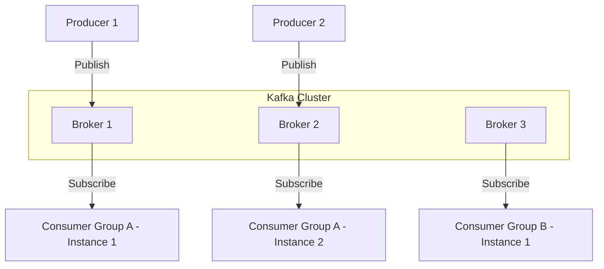

# Apache Kafka Core Concepts & Terminologies

Apache Kafka is a distributed event streaming platform capable of handling trillions of events a day. It is designed to be fault-tolerant, highly scalable, and provide high-throughput, low-latency processing of real-time data feeds.

---

## High-Level Architecture

Kafka operates as a distributed system of **brokers** grouped into a **cluster**. Clients communicate with the cluster to either publish events (Producers) or consume events (Consumers).



---

## Core Cluster Components

### 1. Broker
A **Broker** is a single Kafka server running the Kafka process. It receives messages from producers, writes them to disk, commits them to physical storage, and serves them to consumers. A cluster is composed of multiple brokers to share the load and ensure redundancy.

### 2. Cluster Controller (ZooKeeper vs. KRaft)
A cluster requires a controller to manage metadata, detect broker failures, elect partition leaders, and coordinate administrative tasks.
- **ZooKeeper Mode (Legacy)**: External consensus service that maintains metadata, ACLs, and coordinates the active controller broker.
- **KRaft Mode (Modern/Recommened)**: Kafka Raft Metadata mode removes the ZooKeeper dependency. Instead, metadata is managed internally using a Raft consensus algorithm running on a subset of the Kafka brokers themselves.

> [!IMPORTANT]
> KRaft mode simplifies cluster administration, improves partition scalability (supporting millions of partitions per cluster), and reduces recovery time during controller failures.

---

## Data Model & Storage

### 1. Topic
A **Topic** is a logical category or feed name to which records are published. Topics in Kafka are always multi-producer and multi-consumer.

### 2. Partition
Topics are divided into **Partitions** (minimum of 1). A partition is an ordered, immutable sequence of records that is continually appended to (a structured commit log). 
* Partitions allow Kafka to scale horizontally by spreading data across multiple brokers.
* **Ordering Guarantee**: Kafka only guarantees strict message ordering *within a single partition*, not across an entire topic.

```
Topic: user-signups
[ Partition 0 ]  Offset: 0 -> 1 -> 2 -> 3 -> 4 (Active Write Head)
[ Partition 1 ]  Offset: 0 -> 1 -> 2 (Active Write Head)
```

### 3. Segment
Partitions are divided into physical files on disk called **Segments**.
* A segment contains the actual messages along with an index file mapping offsets to physical positions.
* When a segment reaches its maximum size or age limit, it is closed, and a new segment is rolled.
* **Log Retention**: Closed segments are deleted or compacted based on the topic's retention policies (`log.cleanup.policy=delete` or `compact`).

---

## Anatomy of a Kafka Message

Every record (message) in Kafka consists of:

| Component | Type | Description |
| :--- | :--- | :--- |
| **Key** | Byte Array | Optional. Used to determine the destination partition via hashing. |
| **Value** | Byte Array | The actual payload (JSON, Avro, Protobuf, String, etc.). |
| **Offset** | Long | A unique sequential ID assigned to each record in a partition. |
| **Timestamp**| Long | The creation time (producer-side) or ingestion time (broker-side). |
| **Headers** | Key-Value Pair | Metadata key-value pairs (useful for tracing, routing, or filtering). |

---

## Replication and High Availability

Kafka replicates partition logs across multiple brokers to prevent data loss.

### 1. Replication Factor
Determines how many copies of the partition exist across the cluster. A replication factor of `3` means one leader and two followers.

### 2. Leader & Followers
* **Leader**: The broker responsible for all read and write operations for a specific partition.
* **Follower**: Brokers that replicate data from the leader. They do not serve write requests (though since Kafka 2.4, they can serve read requests under specific configurations like `client.rack` for closer data centers).

### 3. In-Sync Replicas (ISR)
The subset of replica brokers that are actively caught up with the leader. If a follower falls too far behind (configured by `replica.lag.time.max.ms`), it is kicked out of the ISR.

> [!TIP]
> To guarantee zero data loss, configure your topic with `min.insync.replicas=2` and your producers with `acks=all`. This ensures that a write is only acknowledged when the leader and at least one in-sync follower have written the record.

---

## Producer Guarantees & Semantics

Producers write data to topics. You can tune write reliability and latency using the `acks` configuration:

* **`acks=0`**: Producer doesn't wait for any acknowledgment. Highly performant but high risk of data loss.
* **`acks=1` (Default)**: Producer waits for the partition leader to write the record to its local log.
* **`acks=all` (or `-1`)**: Producer waits for the leader and all in-sync replicas (ISR) to acknowledge the write.

---

## Consumer Groups & Offsets

Consumers read data from partitions. Kafka coordinates reading via **Consumer Groups**.

### 1. Consumer Group
A group of consumers with the same `group.id` working together to consume a topic. 
* Each partition in a topic is assigned to exactly *one* consumer instance within a group.
* If you have more consumers than partitions, the extra consumers remain idle.
* If you have fewer consumers than partitions, some consumers will read from multiple partitions.

```
Consumer Group (3 Consumers)
- Consumer 1 reads Partition 0
- Consumer 2 reads Partition 1
- Consumer 3 reads Partition 2
```

### 2. Offset Commits
Consumers track their progress by committing the last read offset to a special internal topic named `__consumer_offsets`.
* **Automatic Commit (`enable.auto.commit=true`)**: Automatically commits offsets periodically. Simple, but risks processing data and failing before the offset is written (data loss/duplication).
* **Manual Commit**: The consumer explicitly commits the offset after finishing processing.
  * **CommitSync**: Blocks until acknowledgment is received. Safer but slower.
  * **CommitAsync**: Non-blocking commit, faster but risk of out-of-order offsets during retries.
