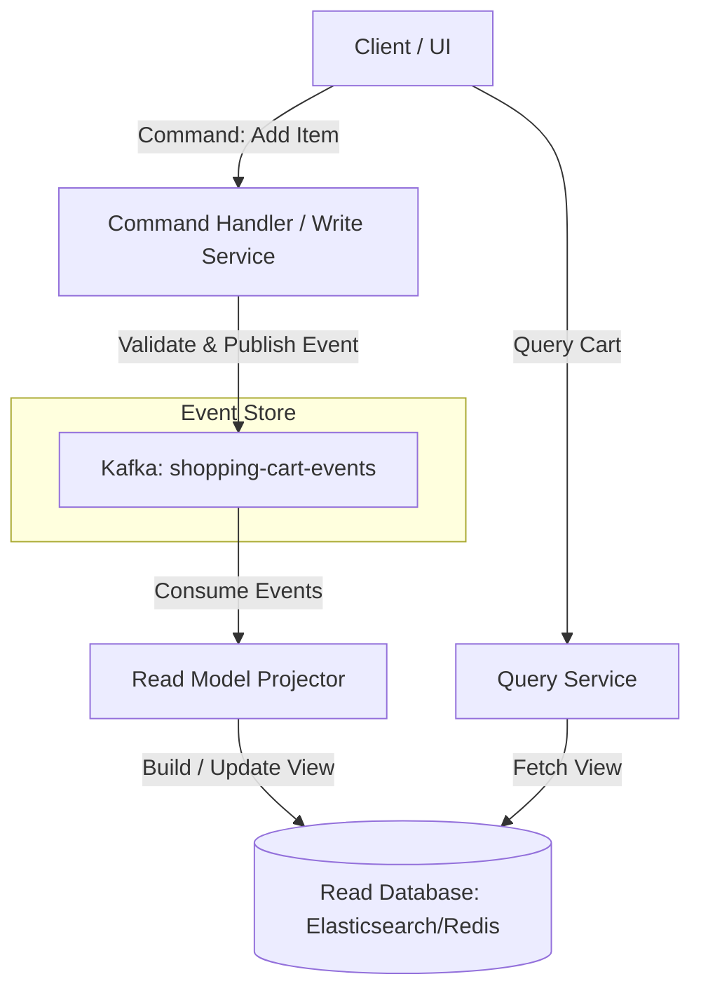

# Kafka Pattern: Event Sourcing & CQRS

In traditional application architectures, databases store the *current state* of an entity. When a user updates their profile or checks out a cart, the system overwrites the database row. 

**Event Sourcing** shifts this paradigm: instead of storing the current state, the system stores the entire sequence of *immutable events* that led to that state. **CQRS** (Command Query Responsibility Segregation) separates the write model (commands/events) from the read model (materialized views/queries).

Kafka is an ideal backbone for Event Sourcing because it provides an append-only, immutable, highly available distributed commit log.

---

## Architectural Workflow



1. **Write Command**: The user submits a command (e.g. `AddItemToCart`).
2. **Command Validation**: The write service validates the command against current business invariants.
3. **Event Persistence**: If valid, the service publishes an event (e.g. `ItemAddedToCart`) to the Kafka event store topic.
4. **State Projection**: Read-model projectors (consumers) listen to the Kafka events and update optimized read databases (e.g., Elasticsearch for search, Redis for speed, PostgreSQL for structured reporting).
5. **Read Query**: The user queries the read databases for the current state.

---

## Key Concepts in Kafka Event Sourcing

### 1. Log Compaction
In a standard topic, old messages are eventually deleted. In an event store, you need to keep historical events to rebuild state. However, storing every minor change forever can lead to massive storage overhead.
* **Log Compaction (`log.cleanup.policy=compact`)**: A feature where Kafka guarantees to retain at least the *last known value* for each message key within a partition.
* If a topic stores cart updates, compaction removes older redundant updates for `cartId: 101` and keeps the latest state payload.

```
Raw Partition:     [Key: A, Val: 1] -> [Key: B, Val: 2] -> [Key: A, Val: 3] -> [Key: C, Val: 1]
Compacted Log:     [Key: B, Val: 2] -> [Key: A, Val: 3] -> [Key: C, Val: 1]
```

### 2. State Reconstruction
To find the current state of an entity, a service can consume all events for that entity's key from offset `0` to the end, applying each event sequentially to a blank object.
* **Snapshotting**: Replaying millions of events from offset `0` can be slow. Services can save periodic snapshots of the state (e.g., every 100 events) and reconstruct state by loading the latest snapshot and replaying only the events that occurred after it.

---

## Real-World Best Practices

### 1. Separate Command and Query Services
* **Best Practice**: Implement the write-path (publishing events to Kafka) and read-path (consuming events, building views, and serving queries) as completely separate microservices. This allows you to scale read operations (which are usually much more frequent) independently of write operations.

### 2. Event Versioning & Schema Design
Events are immutable; once published, they cannot be modified. However, application requirements change.
* **Best Practice**: Establish an event versioning strategy. Design schemas to support optional fields for forward/backward compatibility, or write adapters (event upgraders) in the projection layer to map old event structures to new models during state reconstruction.

### 3. Log Compaction Tombstones
If you need to delete an entity (e.g., delete a user cart), you cannot just delete it from the read model, because replaying the log will reconstruct it.
* **Best Practice**: Publish a message with the entity's key and a `null` value (this is called a **Tombstone**). When log compaction runs, it removes all previous messages for that key, and eventually cleans up the tombstone itself, signaling to projectors that the entity is deleted.
