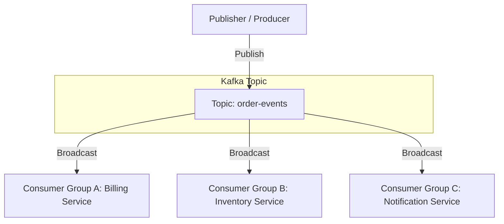

# Kafka Pattern: Publish-Subscribe

The **Publish-Subscribe (Pub-Sub)** pattern is a messaging pattern where senders (publishers) do not program the messages to be sent directly to specific receivers (subscribers). Instead, published messages are characterized into channels or topics, without knowledge of which subscribers, if any, there may be.

---

## Architectural Overview

In Kafka, Pub-Sub is the default mechanism. A publisher is represented by a **Producer**, and subscribers are represented by **Consumer Groups**. Each consumer group receives a complete copy of every message published to the topic.



---

## Key Characteristics of Kafka Pub-Sub

Unlike traditional message queues (like RabbitMQ) which delete messages once they are consumed, Kafka retains all messages on disk for a configured retention period. This enables key features:

1. **Decoupled Lifecycles**: Publishers and subscribers do not need to be online at the same time.
2. **Replayability**: Consumers can reset their offsets to reprocess past messages, which is useful for debugging, data recovery, or spinning up new services that need historical data.
3. **No performance degradation with scale**: Adding new consumer groups does not affect the write throughput of the producers or slow down other consumer groups.

---

## Code Example: Producing and Consuming Events (Node.js/kafkajs)

### 1. Publisher (Producer)
The producer publishes serialized events to a topic:

```javascript
const { Kafka } = require('kafkajs');

const kafka = new Kafka({
  clientId: 'billing-app',
  brokers: ['localhost:9092']
});

const producer = kafka.producer();

async function publishOrderEvent(order) {
  await producer.connect();
  
  // Partitioning by customerId to ensure strict ordering of events per customer
  await producer.send({
    topic: 'order-events',
    messages: [
      {
        key: order.customerId.toString(),
        value: JSON.stringify(order),
        headers: { eventType: 'OrderCreated' }
      }
    ]
  });
  
  await producer.disconnect();
}
```

### 2. Subscriber (Consumer Group A - Billing Service)
Each subscriber group registers with its own `groupId` to receive all events from the topic:

```javascript
const consumer = kafka.consumer({ groupId: 'billing-service-group' });

async function runSubscriber() {
  await consumer.connect();
  await consumer.subscribe({ topic: 'order-events', fromBeginning: true });

  await consumer.run({
    eachMessage: async ({ topic, partition, message }) => {
      const payload = JSON.parse(message.value.toString());
      console.log(`Processing invoice for order ${payload.orderId}`);
      // Business logic here
    },
  });
}
```

---

## Real-World Best Practices

### 1. Partition Keys & Message Ordering
When publishing events, Kafka routes messages to partitions. By default, it uses round-robin or sticky partitioning.
* **Best Practice**: Always specify a **Partition Key** (e.g., `customerId` or `orderId`) for events that require strict order preservation. All messages with the same key will go to the same partition, guaranteeing they are processed in order.

### 2. Schema Evolution and Registry
Since publishers and subscribers are completely decoupled, changing the event schema can break downstream services.
* **Best Practice**: Use a **Schema Registry** (like Confluent Schema Registry) with Avro or Protobuf. This enforces compatibility rules (backward, forward, or full compatibility) and prevents broken payloads from being published to the topic.

### 3. Idle Consumers (Oversubscription)
If a consumer group has more consumer instances than the partition count of the topic, the excess consumers will sit idle.
* **Best Practice**: Balance your partition count. If you expect to scale a subscriber service to 10 instances to handle spike loads, ensure the topic has *at least* 10 partitions.

### 4. Idempotency on the Producer
Network issues can cause producers to retry sending messages, leading to duplicate events.
* **Best Practice**: Enable `enable.idempotence=true` on the producer. This assigns a sequence number to each batch of messages, enabling the broker to discard duplicates automatically.
