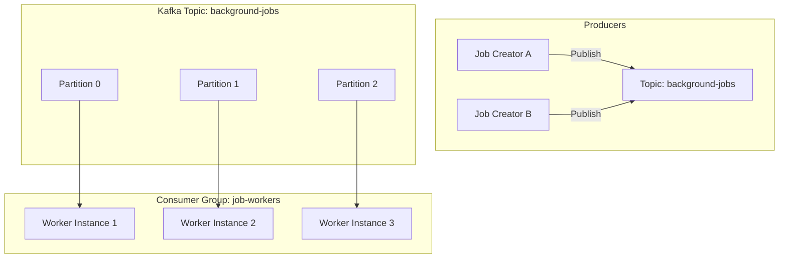

# Kafka Pattern: Message Queueing

Traditional message queues use the **Competing Consumers** pattern: multiple consumers read from a single queue, and each message is processed by exactly one consumer. This allows work to be distributed (load balanced) dynamically among instances.

While Kafka is architecturally a commit log, it can easily implement the Message Queueing pattern through the use of **Partitions** and **Consumer Groups**.

---

## Architectural Overview

To simulate a queue in Kafka:
1. Publish all tasks/messages to a single topic.
2. Group all processing worker instances under the **same `group.id`**.
3. Kafka distributes the topic's partitions among the workers in the consumer group.

---

## Key Differences from Traditional Queues

| Feature | Traditional Queue (e.g. RabbitMQ) | Kafka Queue Pattern |
| :--- | :--- | :--- |
| **Delivery Model** | Messages pushed dynamically to next free worker. | Partition ownership statically assigned to workers. |
| **Scaling Granularity** | Workers can scale independently up to any number. | Scaling limit is capped by the number of partitions. |
| **Acknowledge Scheme** | Individual messages are acked. | Offset commits are sequential (ack up to Offset N). |
| **Ordering** | Hard to maintain with competing consumers. | Guaranteed within a partition, even with competing consumers. |

---

## Implementing a Queue: Partition Assignment & Rebalancing

Kafka handles the distribution of work using partition assignment algorithms (e.g., *Range*, *RoundRobin*, or *Cooperative Sticky*). 

When a consumer instance joins or leaves the group, Kafka triggers a **Rebalance**:
* **Eager Rebalancing (Classic)**: All consumers stop reading, release their partitions, and wait for new assignments. This causes temporary group downtime ("stop-the-world").
* **Cooperative Sticky Rebalancing (Modern)**: Partitions are reassigned incrementally without pausing unaffected consumers.

---

## Real-World Best Practices

### 1. Partition Overhead Planning
Since you cannot have more active consumers than partitions, size your partitions for future growth.
* **Best Practice**: Create topics with more partitions than your current concurrency needs (e.g., 12 or 24 partitions). This gives your service room to scale out worker instances without having to recreate the topic or execute a partition expansion (which can break key-based ordering).

### 2. Processing Time & Session Timeouts
If a worker takes too long to process a single task, Kafka might think the worker has crashed.
* **`max.poll.interval.ms`**: The maximum delay between poll calls. If exceeded, the consumer leaves the group, triggering a rebalance.
* **`session.timeout.ms`**: The time a consumer can go without sending heartbeats before being considered dead.
* **Best Practice**: For long-running background tasks, do not process them directly on the Kafka consumer thread. Instead, hand tasks off to an internal worker thread pool (e.g., Node.js worker threads or a Go goroutine pool) and pause the Kafka consumer if the thread pool is saturated.

### 3. Handling Poison Pills
A "poison pill" is a message that cannot be processed because it is corrupted or contains invalid data, causing the worker to crash or fail repeatedly.
* **Best Practice**: Wrap your consumer logic in a try-catch block. If processing fails, do not block the partition. Instead, commit the offset (so you don't process it again) and route the failed message to a separate **Retry/Dead Letter Queue (DLQ)** topic for asynchronous inspection.
