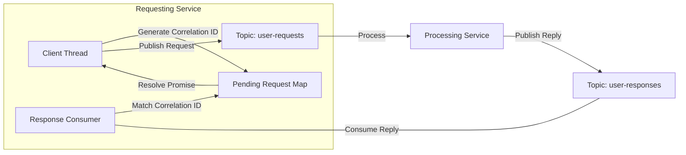

# Kafka Pattern: Request-Reply

While Kafka is inherently an asynchronous, event-driven streaming platform, there are use cases where a client service needs to make a request and synchronously block or wait for a specific response (similar to an HTTP call or gRPC request, but using Kafka topics).

The **Request-Reply** pattern enables synchronous-like RPC over asynchronous, decoupled Kafka streams.

---

## Architectural Design

To implement Request-Reply, we use two topics and coordinate messages using **Correlation IDs**.



### 1. Request Topic
The topic where the requesting client publishes the request payload.

### 2. Reply-To Topic
The topic where the processing service publishes the response. 
* **Shared Reply Topic (Recommended)**: All instances of a client service consume from a single, shared reply topic. Individual instances use consumer groups and partition routing to filter responses.
* **Ephemeral Reply Topic (Antipattern)**: Creating a temporary topic per request/instance. This creates substantial metadata overhead on the Kafka cluster and slows down the application.

### 3. Correlation ID & Reply-To Headers
Kafka message **Headers** are used to route and associate responses:
* `correlationId`: A unique UUID generated by the requestor.
* `replyTo`: The name of the topic where the reply should be sent.

---

## Step-by-Step Execution Flow

1. **Client Service** generates a unique `correlationId` (UUID).
2. **Client Service** registers a callback/promise in an in-memory map keyed by the `correlationId`.
3. **Client Service** publishes the request to the `request-topic` with headers containing `correlationId` and `replyTo`.
4. **Processor Service** consumes the request, performs the business logic, and extracts the headers.
5. **Processor Service** publishes the response to the topic specified in the `replyTo` header, copying the `correlationId` into the response headers.
6. **Client Service**'s response consumer reads the response, looks up the `correlationId` in the in-memory map, resolves the registered promise, and cleans up the map.

---

## Code Example (Node.js/kafkajs)

### Client Side Implementation

```javascript
const { Kafka } = require('kafkajs');
const { v4: uuidv4 } = require('uuid');

const kafka = new Kafka({ brokers: ['localhost:9092'] });
const producer = kafka.producer();
const consumer = kafka.consumer({ groupId: 'client-response-group' });

const pendingRequests = new Map(); // correlationId -> { resolve, reject, timer }

async function setup() {
  await producer.connect();
  await consumer.connect();
  await consumer.subscribe({ topic: 'payment-replies', fromBeginning: false });

  // Start listening for responses
  consumer.run({
    eachMessage: async ({ message }) => {
      const correlationId = message.headers.correlationId?.toString();
      if (pendingRequests.has(correlationId)) {
        const { resolve, timer } = pendingRequests.get(correlationId);
        clearTimeout(timer);
        
        const responseData = JSON.parse(message.value.toString());
        resolve(responseData);
        pendingRequests.delete(correlationId);
      }
    }
  });
}

function sendRequest(payload, timeoutMs = 5000) {
  return new Promise(async (resolve, reject) => {
    const correlationId = uuidv4();
    
    // Set timeout handling
    const timer = setTimeout(() => {
      pendingRequests.delete(correlationId);
      reject(new Error(`Request timed out after ${timeoutMs}ms`));
    }, timeoutMs);

    pendingRequests.set(correlationId, { resolve, reject, timer });

    await producer.send({
      topic: 'payment-requests',
      messages: [{
        value: JSON.stringify(payload),
        headers: {
          correlationId,
          replyTo: 'payment-replies'
        }
      }]
    });
  });
}
```

---

## Real-World Best Practices

### 1. In-Memory Map Cleanup (Memory Leaks)
If the processing service crashes or drops a message, the client will never receive a reply. 
* **Best Practice**: Always set a timeout (e.g., 5000ms) for each pending promise. When the timer expires, reject the promise and delete the entry from the in-memory map to prevent memory leaks.

### 2. Scaling the Client Response Consumer
If you have multiple instances of the Client Service, they will all consume from the `payment-replies` topic. 
* **The Problem**: If instance A sends a request, the response might be consumed by instance B because they share the same consumer group. Instance B will look up the `correlationId` in its map, fail to find it, and discard it.
* **The Solution**: Either configure the Response Consumers to use **distinct consumer groups** (e.g., append hostname/pod-name to the group ID so each instance gets a copy of every message) or configure custom partition assignment where responses are routed to the partition assigned to the specific requesting instance.

### 3. Consider gRPC / HTTP First
* **Best Practice**: Use Request-Reply over Kafka only when it is absolutely necessary (e.g., you need message persistence, queueing during consumer downtime, or unified event auditing). For simple synchronous microservice-to-microservice communication, **gRPC** or **HTTP/REST** is significantly faster, simpler to implement, and has less overhead.
