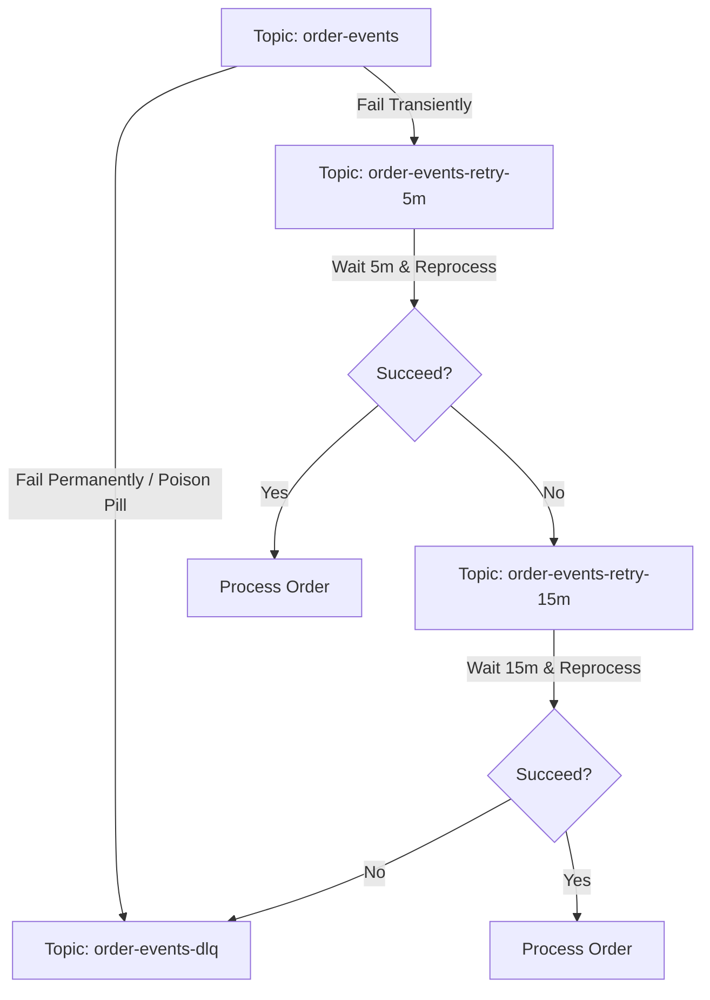

# Kafka Pattern: Retry & Dead Letter Queue (DLQ)

When processing messages in a streaming application, failures are inevitable. These can range from transient errors (e.g., a database connection timeout) to non-transient errors (e.g., a schema validation error or null-pointer exception).

Simply crashing the consumer or blocking the partition is unacceptable in high-throughput environments. The **Retry & Dead Letter Queue (DLQ)** pattern provides a robust, non-blocking error handling mechanism.

---

## The Challenge with Kafka Error Handling

In traditional message queues, you can selectively acknowledge or reject individual messages. 
In Kafka, offsets are committed **sequentially**. If message at offset `10` fails, you cannot skip it and commit offset `11` without losing the ability to retry offset `10` later. If you block partition processing to retry offset `10` indefinitely, you create a line-of-blockage (head-of-line blocking) for all messages behind it.

---

## Architectural Solution: Non-Blocking Retries

To achieve non-blocking retries, we use a chain of retry topics and a final DLQ topic.

### 1. Main Topic
The consumer attempts to process incoming events. If it succeeds, the offset is committed.

### 2. Retry Topics
If processing fails due to a transient error:
* The consumer publishes the message to a retry topic (e.g. `order-events-retry-5m`).
* The consumer commits the offset on the main topic to keep processing subsequent messages.
* A separate, dedicated retry consumer listens to `order-events-retry-5m`. It enforces a delay (backoff) before processing (e.g., using `Thread.sleep` or pausing the consumer partition if the message timestamp is too recent) to avoid hammering the downstream dependency.

### 3. Dead Letter Queue (DLQ) Topic
If a message exceeds the maximum number of retries or fails due to a non-transient error:
* The message is published to the `order-events-dlq` topic.
* An operations team or automated system can inspect the payload, patch the root cause, and replay the message back into the main topic.

---

## Real-World Best Practices

### 1. Distinguishing Error Types
* **Transient Errors**: Database locks, network timeouts, downstream HTTP 503 errors. **Action**: Route to Retry Topic.
* **Non-Transient Errors (Poison Pills)**: JSON parsing errors, DB foreign key violations, schema mismatches. **Action**: Route directly to DLQ. Do not retry, as retrying will never succeed and will waste resources.

### 2. Header Metadata Preservation
When moving messages to retry or DLQ topics, it is vital to preserve the original message context.
* **Best Practice**: Copy the original message's value and key, and inject metadata into the **Headers**:
  * `x-original-topic`: The source topic name.
  * `x-original-partition`: The source partition ID.
  * `x-original-offset`: The source offset.
  * `x-exception-message`: The error message or exception stack trace.
  * `x-retry-count`: Current retry attempt counter.

### 3. Message Ordering Implications
> [!WARNING]
> Routing failed messages to retry/DLQ topics breaks the strict order of message processing for that partition. If order preservation is business-critical (e.g., processing ledger transactions for a single account), you **cannot** use non-blocking retries. You must stop the partition consumer, log the alert, and block further processing until human intervention resolves the error.

### 4. Backoff Implementation (The Right Way)
Do not simply loop and sleep in your main message loop, as this will trigger partition rebalances if the poll interval is exceeded.
* **Best Practice**: Use an event-driven delayed consumer. The consumer reads a message from the retry topic, checks the message timestamp + backoff delay, and if the current time is less than the target time, it **pauses the partition** and schedules a resume timer. This allows the consumer to maintain active heartbeats without consuming new messages prematurely.
