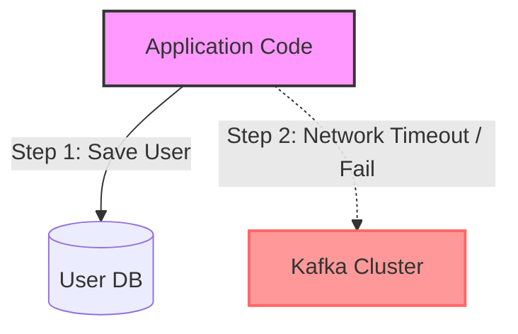
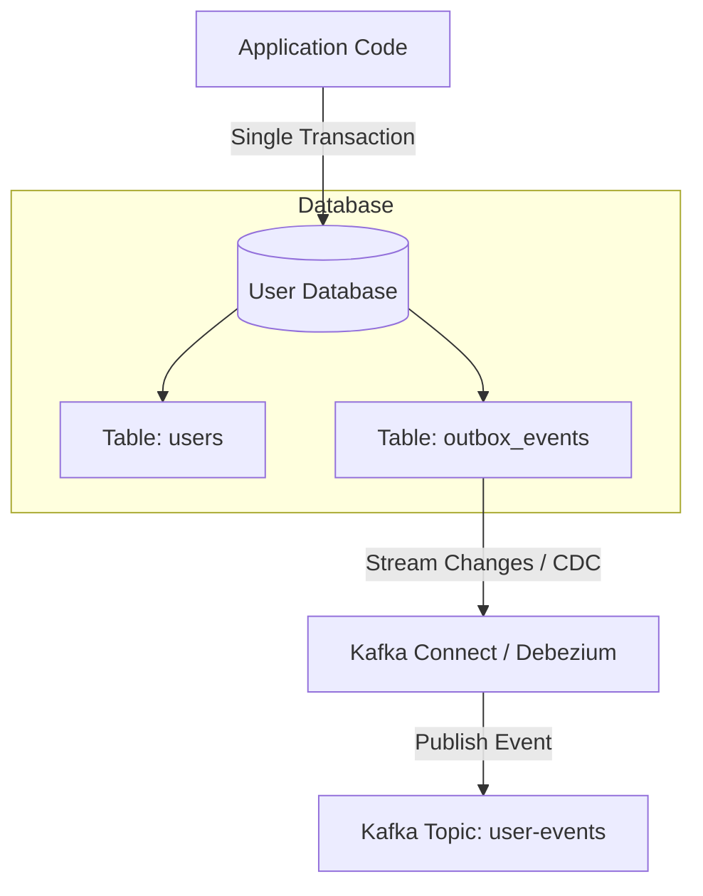

# Kafka Pattern: Transactional Outbox

In distributed architectures, microservices often need to perform two actions: update their local application database (e.g., save a new user record) and publish an event to Kafka (e.g., publish `UserCreated`).

Doing this directly in code (known as the **Dual-Write Problem**) is highly prone to failures. If the database write succeeds but the Kafka publish fails (or vice versa), the system falls into an inconsistent state.

The **Transactional Outbox** pattern solves this by ensuring atomic operations: either both actions succeed, or both fail.

---

## The Dual-Write Problem



* **Scenario A**: Write to DB succeeds, but sending the event to Kafka fails (network timeout, broker down). Result: Downstream services never receive the event.
* **Scenario B**: Send to Kafka succeeds, but DB commit fails (rollback due to constraint error). Result: Downstream services process an event for an entity that doesn't exist.

---

## Architectural Solution: Transactional Outbox

Instead of writing to the DB and Kafka separately, the application writes to **two tables in the same database** under a **single database transaction**.



1. **Atomic Write**: The application performs the business operation (inserts into the `users` table) and writes the event payload into an `outbox_events` table under the same ACID transaction.
2. **Transaction Commit**: The database transaction is committed. If either write fails, the entire transaction rolls back.
3. **Event Extraction**: A background process reads the `outbox_events` table and publishes the messages to Kafka.
4. **Clean up / Mark Sent**: Once published, the event in the outbox table is deleted or marked as processed.

---

## Event Extraction Mechanisms

There are two primary ways to poll the outbox table and publish events to Kafka:

### 1. Change Data Capture (CDC) - Recommended
CDC tools watch the database's transaction log (e.g., PostgreSQL Write-Ahead Log/WAL, MySQL Binlog) directly.
* **Debezium**: An open-source distributed CDC platform built on top of **Kafka Connect**.
* **Pros**: Extremely low latency, zero overhead on application database queries, doesn't require polling queries, and runs asynchronously.

### 2. Database Polling
A background scheduler polls the outbox table at short intervals (e.g., every 500ms):
`SELECT * FROM outbox_events WHERE status = 'PENDING' LIMIT 100`
* **Pros**: Simple to set up without extra infrastructure.
* **Cons**: Introduces database query overhead, poll lag, and locking issues when scaled.

---

## Outbox Table Schema Example

Here is a standard SQL schema for an outbox table:

```sql
CREATE TABLE outbox_events (
    id UUID PRIMARY KEY,
    aggregate_type VARCHAR(255) NOT NULL, -- e.g., 'User' or 'Order'
    aggregate_id VARCHAR(255) NOT NULL,   -- e.g., customerId or orderId
    event_type VARCHAR(255) NOT NULL,     -- e.g., 'UserCreated'
    payload JSONB NOT NULL,               -- The message payload
    created_at TIMESTAMP WITH TIME ZONE DEFAULT CURRENT_TIMESTAMP
);
```

---

## Real-World Best Practices

### 1. Delivery Guarantees (At-Least-Once)
Because the outbox processor (like Debezium) can fail or restart mid-execution, it might publish the same outbox entry to Kafka twice.
* **Best Practice**: Downstream consumers *must* be **idempotent**. Consumers should check a unique identifier (like the outbox event `id` UUID) against a cache or database of processed messages before processing the business logic.

### 2. Table Maintenance & Bloat
If your application processes millions of events a day, your outbox table will grow rapidly, leading to performance degradation and disk bloat.
* **Best Practice**: If using Debezium, it only reads the transaction log, so you can delete records immediately after insertion or run a cron job to purge rows:
  `DELETE FROM outbox_events WHERE created_at < NOW() - INTERVAL '1 day';`

### 3. Kafka Connect SMTs (Single Message Transforms)
By default, Debezium CDC outputs a complex payload showing the old row state, new row state, and database metadata.
* **Best Practice**: Use Kafka Connect **SMT**s (like `io.debezium.transforms.ExtractNewRecordState`) to flatten the message payload so that downstream Kafka consumers receive clean, easy-to-use event payloads containing just the outbox record's values.
