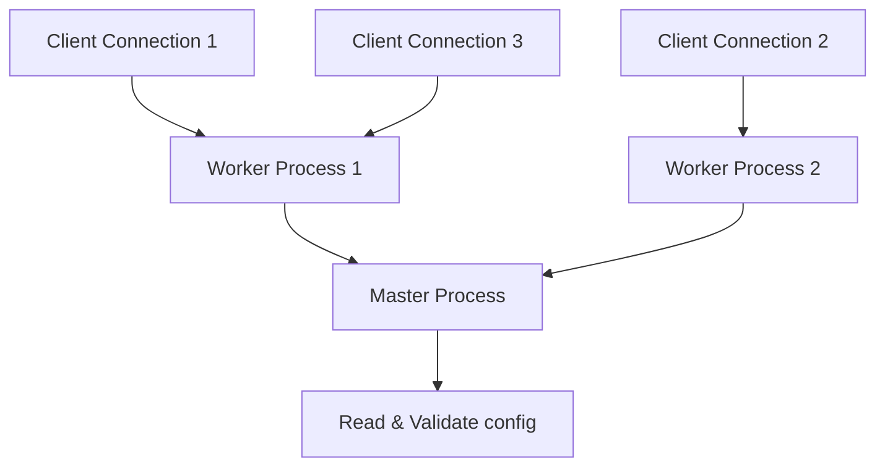

# Nginx Core Concepts & Configuration

A comprehensive, production-grade guide to understanding Nginx architecture, its process model, configuration structure, and core directives.

---

## Introduction

Nginx (pronounced "engine-x") is an open-source, high-performance HTTP server, reverse proxy, and IMAP/POP3 proxy server. Known for its stability, rich feature set, simple configuration, and low resource consumption, Nginx powers a massive portion of the modern web.

Unlike traditional web servers that spawn a new thread or process for each connection, Nginx uses a highly scalable, event-driven (asynchronous) architecture. This allows it to handle tens of thousands of concurrent connections with a very small and predictable memory footprint.

---

## 1. Process Architecture

Nginx runs with a single **Master Process** and one or more **Worker Processes**.



### Master Process
*   Responsible for reading and validating configuration files.
*   Manages worker processes (starts, stops, and reloads them without dropping client connections).
*   Performs privileged operations such as binding to network ports (e.g., `80`, `443`).

### Worker Processes
*   Handle actual network connections, read and write requests, and communicate with upstream servers.
*   Run as non-privileged users (usually `nginx` or `www-data`) to enhance security.
*   Typically configured to match the number of CPU cores to maximize performance (`worker_processes auto;`).

---

## 2. Configuration Block Structure

Nginx configuration files (`nginx.conf`) are organized into a tree-like hierarchy of contexts (blocks). Directives inside a context inherit settings from their parent context, which can be overridden locally.

```text
main (Global Context)
├── events Context
└── http Context
    ├── server Context (Virtual Host)
    │   ├── location Context (URI Matching)
    │   └── location Context
    └── server Context
```

### Directives and Contexts

*   **Directives**: Configuration options consisting of a name and parameters, ending with a semicolon (e.g., `worker_connections 1024;`).
*   **Blocks/Contexts**: Directives enclosed in braces `{ ... }` that group related configurations.

| Context | Purpose |
| :--- | :--- |
| **Main (Global)** | Configures global settings such as worker processes, logging, and system-wide performance. |
| **events** | Configures connection handling (e.g., connection limits per worker). |
| **http** | Configures HTTP-specific settings, including MIME types, compression, logging formats, and server defaults. |
| **server** | Defines a virtual host (website/service) with a specific domain, port, and SSL certificates. |
| **location** | Configures how Nginx handles requests for specific URIs or paths within a server block. |

---

## 3. Base Configuration Blueprint

Here is a hardened, production-ready base `nginx.conf` showcasing the core layout:

```nginx
# Global Settings
user nginx;
worker_processes auto;
pid /var/run/nginx.pid;
error_log /var/log/nginx/error.log warn;

# Connection Settings
events {
    worker_connections 1024;
    use epoll; # Efficient connection processing (Linux-specific)
    multi_accept on; # Accept multiple connections at once
}

# HTTP Web Settings
http {
    include /etc/nginx/mime.types;
    default_type application/octet-stream;

    # Logging format
    log_format main '$remote_addr - $remote_user [$time_local] "$request" '
                    '$status $body_bytes_sent "$http_referer" '
                    '"$http_user_agent" "$http_x_forwarded_for"';

    access_log /var/log/nginx/access.log main;

    # Performance Optimization
    sendfile on;
    tcp_nopush on;
    tcp_nodelay on;
    keepalive_timeout 65;
    types_hash_max_size 2048;
    server_tokens off; # Hides Nginx version for security

    # Dynamic Configurations Inclusion
    include /etc/nginx/conf.d/*.conf;
}
```

---

## 4. Understanding Location Matching

The `location` directive is critical for routing requests. Nginx evaluates location blocks using specific matching rules:

```nginx
# 1. Exact Match (=)
location = /favicon.ico {
    # Matches ONLY /favicon.ico
}

# 2. Preferential Prefix Match (^~)
location ^~ /images/ {
    # Matches any URI starting with /images/ and stops searching regex patterns
}

# 3. Case-Sensitive Regex Match (~)
location ~ \.(gif|jpg|png)$ {
    # Matches URLs ending in .gif, .jpg, or .png
}

# 4. Case-Insensitive Regex Match (~*)
location ~* \.js$ {
    # Matches .js, .JS, etc.
}

# 5. Standard Prefix Match (default)
location /docs/ {
    # Matches any URI starting with /docs/
}
```

> [!IMPORTANT]
> **Matching Order of Operations**:
> 1. Nginx checks exact matches (`=`). If found, it stops.
> 2. It checks all prefix matches. It remembers the longest match.
> 3. If the longest prefix match has the `^~` modifier, Nginx stops and uses it.
> 4. Otherwise, it checks regex matches (`~` and `~*`) in the order they appear in the file. The first regex match wins.
> 5. If no regex matches, it uses the longest prefix match remembered from step 2.
