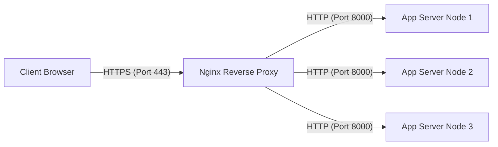

# Nginx Reverse Proxy & Load Balancing

A comprehensive, production-grade guide to configuring Nginx as a reverse proxy, enabling SSL/TLS termination, and utilizing high-performance load balancing algorithms.

---

## Introduction

A **Reverse Proxy** acts as an intermediary between client devices and backend web servers. It intercepts requests, handles TLS/SSL negotiation, buffers large payloads, and forwards requests to backend services. 

A **Load Balancer** distributes client requests across multiple backend application instances to ensure scalability, redundancy, and high availability.



---

## 1. Reverse Proxy Configuration

To forward traffic from Nginx to a backend service (e.g., a Node.js or Go application running on `localhost:3000`), we use the `proxy_pass` directive inside a `location` block.

### Production Proxy Blueprint

```nginx
server {
    listen 80;
    server_name api.example.com;

    location / {
        # Forward request to upstream/backend server
        proxy_pass http://127.0.0.1:3000;

        # Set standard HTTP headers for backend awareness
        proxy_set_header Host $host;
        proxy_set_header X-Real-IP $remote_addr;
        proxy_set_header X-Forwarded-For $proxy_add_x_forwarded_for;
        proxy_set_header X-Forwarded-Proto $scheme;

        # Connection tweaks
        proxy_http_version 1.1;
        proxy_set_header Connection "";
        
        # Buffer and timeouts settings
        proxy_connect_timeout 60s;
        proxy_send_timeout 60s;
        proxy_read_timeout 60s;
        proxy_buffers 8 16k;
        proxy_buffer_size 32k;
    }
}
```

### Key Headers Decoded
*   `Host`: Passes the original HTTP host header sent by the client. Without this, the backend server sees the address of Nginx instead of the domain requested by the user.
*   `X-Real-IP`: Passes the exact IP address of the client connection.
*   `X-Forwarded-For`: Accumulates IP addresses of every proxy the request has traversed (comma-separated).
*   `X-Forwarded-Proto`: Informs the backend whether the user accessed the site over HTTP or HTTPS.

---

## 2. SSL/TLS Termination & HTTP/2

Handling SSL handshakes consumes significant CPU. Offloading (terminating) SSL at Nginx frees backend applications from TLS complexity.

```nginx
server {
    listen 80;
    server_name app.example.com;
    
    # Redirect all HTTP requests to HTTPS
    return 301 https://$host$request_uri;
}

server {
    listen 443 ssl http2;
    server_name app.example.com;

    # SSL Certificates
    ssl_certificate /etc/letsencrypt/live/example.com/fullchain.pem;
    ssl_certificate_key /etc/letsencrypt/live/example.com/privkey.pem;

    # SSL Protocols & Ciphers (Modern Hardened Profile)
    ssl_protocols TLSv1.2 TLSv1.3;
    ssl_prefer_server_ciphers on;
    ssl_ciphers 'ECDHE-ECDSA-AES128-GCM-SHA256:ECDHE-RSA-AES128-GCM-SHA256:ECDHE-ECDSA-AES256-GCM-SHA384:ECDHE-RSA-AES256-GCM-SHA384:DHE-RSA-AES128-GCM-SHA256:DHE-RSA-AES256-GCM-SHA384';

    # SSL Session Optimization
    ssl_session_cache shared:SSL:10m;
    ssl_session_timeout 1d;
    ssl_session_tickets off;

    # Security Headers
    add_header Strict-Transport-Security "max-age=63072000; includeSubDomains; preload" always;

    location / {
        proxy_pass http://127.0.0.1:3000;
        proxy_set_header Host $host;
        proxy_set_header X-Real-IP $remote_addr;
        proxy_set_header X-Forwarded-For $proxy_add_x_forwarded_for;
        proxy_set_header X-Forwarded-Proto https;
    }
}
```

> [!TIP]
> Enabling `http2` in the `listen 443 ssl http2;` directive allows multiplexing, header compression, and server push, boosting resource delivery speeds by up to 50%.

---

## 3. Load Balancing Configuration

Nginx groups backend servers into an pool using the `upstream` directive.

### Load Balancing Algorithms

#### A. Round Robin (Default)
Distributes requests sequentially among all servers in the pool.

```nginx
upstream app_servers {
    server app-node1.internal:8080;
    server app-node2.internal:8080;
    server app-node3.internal:8080;
}
```

#### B. Weighted Round Robin
Allows sending more traffic to servers with higher computing power.

```nginx
upstream app_servers_weighted {
    server app-highspec.internal:8080 weight=3; # Receives 3/5 of connections
    server app-lowspec.internal:8080 weight=1;  # Receives 1/5 of connections
    server app-backupspec.internal:8080 weight=1;
}
```

#### C. Least Connections (`least_conn`)
Directs traffic to the server with the fewest active active connections, useful for long-running database requests or file downloads.

```nginx
upstream app_servers_least_conn {
    least_conn;
    server app-node1.internal:8080;
    server app-node2.internal:8080;
}
```

#### D. IP Hash (`ip_hash`)
Pins clients to the same backend server based on their IP address, providing basic session persistence (sticky sessions).

```nginx
upstream app_servers_sticky {
    ip_hash;
    server app-node1.internal:8080;
    server app-node2.internal:8080;
}
```

---

## 4. Passive Health Checks & Failover

Nginx can monitor upstream node failures and automatically route around broken instances using `max_fails` and `fail_timeout`.

```nginx
upstream resilient_servers {
    # If app-node1 fails 3 times in 30 seconds, mark it offline for the next 30 seconds
    server app-node1.internal:8080 max_fails=3 fail_timeout=30s;
    server app-node2.internal:8080 max_fails=3 fail_timeout=30s;
    
    # Backup server used only when all other nodes are down
    server app-fallback.internal:8080 backup;
}

server {
    listen 80;
    server_name example.com;

    location / {
        proxy_pass http://resilient_servers;
    }
}
```
