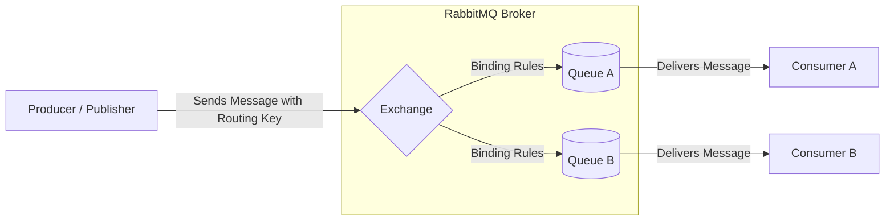
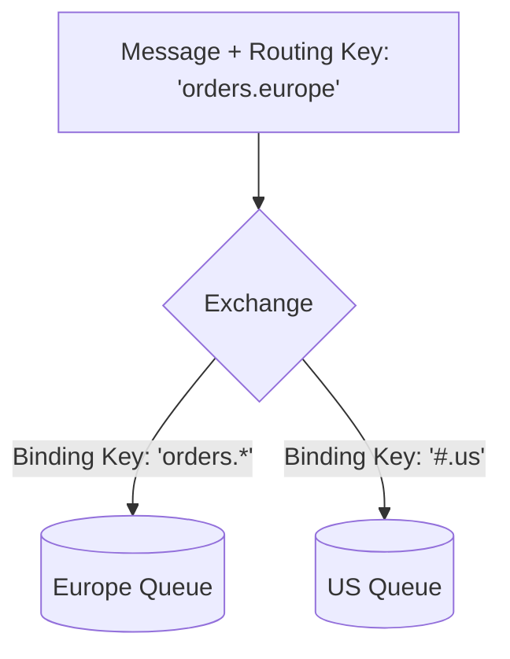
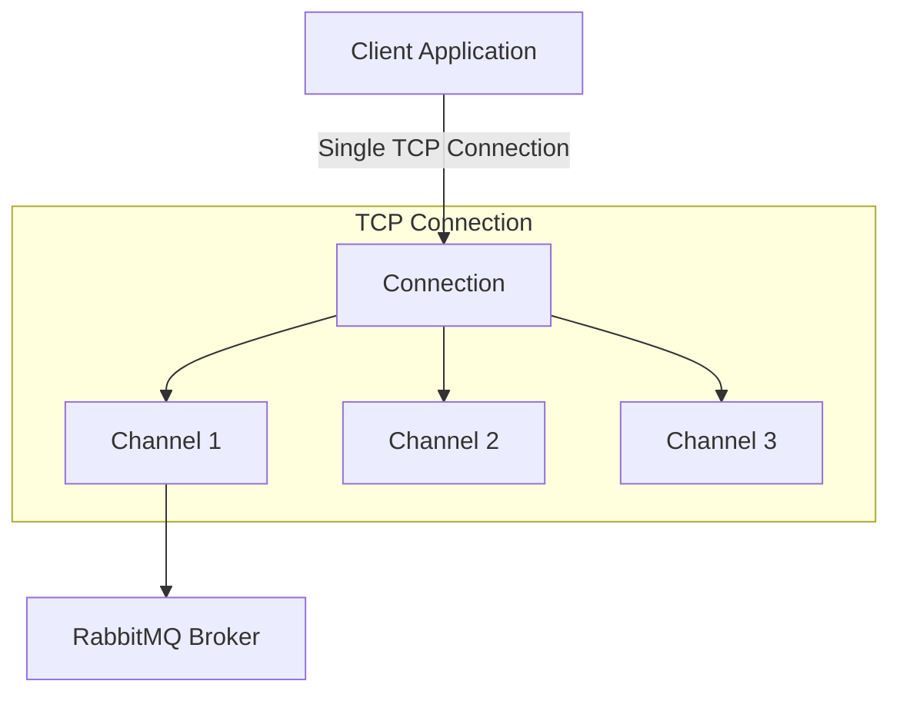

# RabbitMQ Terminologies & Concepts

A comprehensive guide explaining the core components, concepts, and terminologies of RabbitMQ, including their functions and how they interact in a message-driven architecture.

---

## Architecture Overview

RabbitMQ operates on a message-brokering model where producers do not send messages directly to queues. Instead, they send messages to exchanges, which then route the messages to queues based on specific rules (bindings).

---

## Core Terminologies & Functions

### 1. Broker
The **Broker** is the RabbitMQ server itself. It acts as the orchestrator that manages client connections, receives messages, routes them through exchanges, stores them in queues, and delivers them to consumers.

### 2. Producer (Publisher)
A client application that creates and sends (publishes) messages to the RabbitMQ broker. The producer designates where the message should go by sending it to an **Exchange** along with a **Routing Key**.

### 3. Consumer (Subscriber)
A client application that connects to RabbitMQ, subscribes to one or more **Queues**, and processes the incoming messages. 

### 4. Message
The unit of data transferred between applications. A message consists of two main parts:
*   **Payload**: The actual data (typically serialized JSON, XML, or plain text) being sent.
*   **Properties/Attributes**: Metadata describing the payload, such as content-type, encoding, priority, correlation ID, expiration time, and custom headers.

---

## Routing & Distribution Components

To successfully route a message from a publisher to a queue, RabbitMQ uses three interconnected concepts: **Exchanges**, **Bindings**, and **Routing Keys**.

### 5. Exchange
An **Exchange** is a message routing agent within the broker. It receives messages from producers and determines how to distribute them to queues. How it routes messages depends on its **Exchange Type** and **Bindings**.

#### Exchange Types:
| Exchange Type | Routing Logic | Typical Use Case |
| :--- | :--- | :--- |
| **Direct** | Routes messages based on a strict, exact match between the message's routing key and the queue's binding key. | Unicast routing (e.g., sending an email task to a specific worker). |
| **Fanout** | Ignores the routing key completely and routes messages to all queues bound to it. | Broadcast routing (e.g., real-time sport score updates, pub/sub configurations). |
| **Topic** | Matches the routing key against wildcard patterns specified in the queue bindings. | Multicast routing (e.g., routing logs based on severity and source like `auth.critical` or `api.info`). |
| **Headers** | Ignores the routing key and routes messages based on attributes defined in the message headers. | Routing on multiple criteria or complex structures (e.g., file type + region). |

> [!NOTE]
> **Topic Exchange Wildcards:**
> *   `*` (star) matches exactly one word. For example, `logs.*` matches `logs.info` and `logs.warn` but not `logs.info.critical`.
> *   `#` (hash) matches zero or more words. For example, `logs.#` matches `logs.info`, `logs.info.critical`, and `logs`.

### 6. Binding
A **Binding** is a link or relationship set up between an exchange and a queue. It defines how messages flow from the exchange to that specific queue.

### 7. Routing Key
An address or label that the producer attaches to a message when publishing it to the exchange.

### 8. Binding Key
An argument or pattern specified by a queue when it binds to an exchange. The exchange compares the incoming message's **Routing Key** against the queue's **Binding Key** to decide whether to route the message.

---

## Connection & Protocol Concepts

### 9. Connection
A physical, long-lived TCP connection established between the client application and the RabbitMQ broker. Creating and destroying TCP connections is resource-intensive.

### 10. Channel
A virtual, lightweight connection established *inside* a physical TCP connection. All API interactions (declaring queues, publishing messages, consuming messages) are performed over channels.
*   **Multiplexing**: Multiple channels share a single TCP connection, drastically reducing network overhead and resource consumption.

### 11. Virtual Host (vhost)
A logical division or namespace within RabbitMQ. Virtual hosts provide complete isolation for connections, exchanges, queues, bindings, and user permissions.
*   Similar to virtual machines or databases, two different vhosts can have queues with the exact same name without conflict.
*   The default vhost is `/`.

---

## Reliability & Lifecycle Concepts

### 12. Message Acknowledgment (Ack / Nack)
An agreement mechanism between the consumer and the broker to ensure messages are not lost if a consumer crashes.
*   **Delivery Acknowledgement (Ack)**: Sent by the consumer to the broker indicating the message has been successfully processed. The broker can now safely delete the message from the queue.
*   **Negative Acknowledgement (Nack / Reject)**: Sent by the consumer when processing fails. The consumer can tell the broker to either **re-queue** the message for another attempt or discard/dead-letter it.

> [!IMPORTANT]
> **Manual vs. Automatic Acknowledgment**
> *   **Auto-Ack**: The broker deletes the message immediately after sending it to the client over TCP. If the client crashes while processing, the message is lost forever.
> *   **Manual-Ack**: The broker keeps the message in flight until it receives an explicit acknowledgment from the consumer. This is recommended for production.

### 13. Dead Letter Exchange (DLX) & Dead Letter Queue (DLQ)
A normal exchange configured to receive messages that are rejected, expired (TTL), or discarded because a queue has reached its maximum length limit.
*   **DLX (Dead Letter Exchange)**: Receives the failed messages.
*   **DLQ (Dead Letter Queue)**: Binds to the DLX. Developers monitor this queue to debug why messages failed or to set up automatic retry mechanisms.

### 14. Message TTL (Time-To-Live)
A property specifying how long (in milliseconds) a message can reside in a queue before it is considered expired and either discarded or moved to a Dead Letter Exchange.
