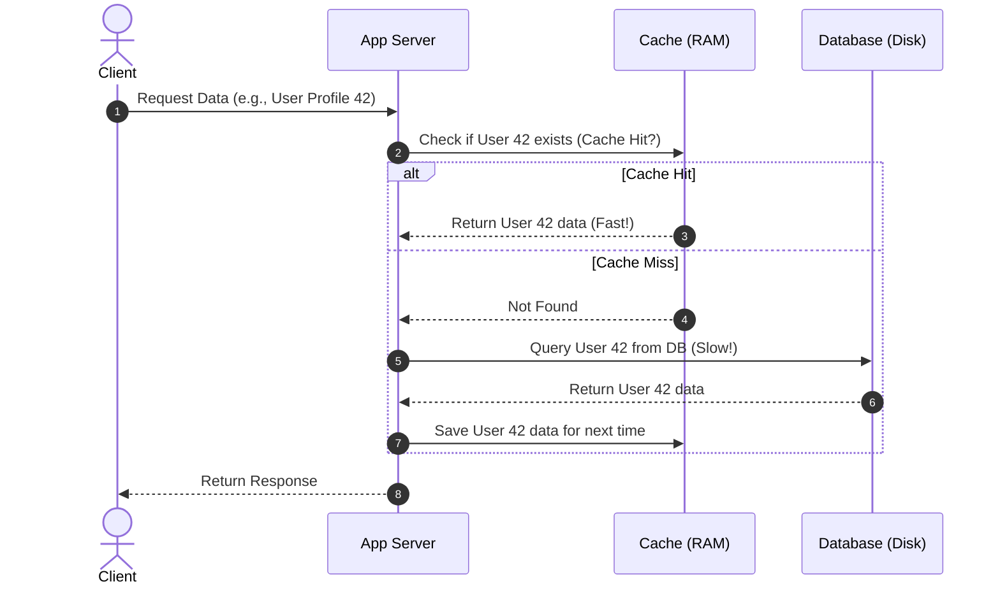

# Caching

Caching is the process of storing copies of data or files in a temporary storage location (called a cache) so that they can be accessed more quickly. In system design, caching is one of the most effective ways to scale an application and dramatically reduce latency.

---

## The Problem It Solves

Accessing data from primary storage (like a relational database, disk, or external API) is slow and resource-intensive:
* **Disk I/O Latency:** Databases read data from disks or SSDs, which is orders of magnitude slower than reading from system memory (RAM).
* **Complex Computations:** Aggregating data, performing joins, or rendering complex templates consumes valuable CPU cycles.
* **Database Bottlenecks:** Under high traffic, a database can become overwhelmed by the sheer volume of read requests, leading to slow response times or database failure.

---

## The Solution

By inserting a high-speed memory layer (like Redis or Memcached) between the application server and the database, we can store frequently requested data in RAM. RAM access is incredibly fast (nanoseconds vs. milliseconds for disk).

By caching, you achieve:
* **Sub-millisecond Latencies:** Delivering data directly from memory.
* **Reduced Server Load:** Offloading reads from the primary database or backend services.
* **Cost Efficiency:** Serving more users with fewer database resources.

---

## Real-World Example

Imagine you are a researcher in a library writing a thesis.

* **Without a Cache (Database only):** Every time you need a fact from a specific reference book, you stand up, walk to the archives, find the shelf, locate the book, write down the note, return the book to the shelf, and walk back to your desk. If you need that fact again in 5 minutes, you repeat the whole journey.
* **With a Cache:** The first time you get the book, you bring it to your desk. For the rest of the day, when you need information from that book, you simply look down at your desk (Cache Hit). Your desk acts as a cache. If you need a book that is not on your desk (Cache Miss), you go to the archives (Database), read it, and place it on your desk for future use.

---

## Caching Strategies

How data is written to and read from the cache determines the strategy. The most common patterns are:

### 1. Cache-Aside (Lazy Loading)
The application code directly coordinates with both the cache and the database (as shown in the sequence diagram above).
* **Pros:** Only requested data is cached (saves space); cache failure is not fatal (app falls back to the database).
* **Cons:** Cache miss penalty on first load; data can become stale if updated in the DB but not invalidated in the cache.

### 2. Write-Through
The application writes data to the cache, and the cache immediately writes the data to the database before returning a success response.
* **Pros:** Cache is never stale; read performance is consistent.
* **Cons:** High write latency because you must write to both systems before responding.

### 3. Write-Behind (Write-Back)
The application writes data only to the cache. The cache asynchronously batch-updates the database after a delay.
* **Pros:** Incredibly fast write speeds; ideal for write-heavy applications.
* **Cons:** Risk of data loss if the cache server crashes before flushing updates to the database.

---

## Cache Eviction Policies

Since memory (RAM) is expensive and limited, caches eventually fill up. Eviction policies define which data is removed to make room for new items:

* **Least Recently Used (LRU):** Discards the items that have not been accessed for the longest time. This is the most common policy.
* **Least Frequently Used (LFU):** Counts how often an item is requested and discards the ones with the lowest request count.
* **First In, First Out (FIFO):** Discards the oldest items regardless of how often or recently they were accessed.
* **Time-to-Live (TTL):** Every cached item is assigned an expiration time (e.g., 3600 seconds). Once the TTL expires, the item is deleted automatically.

---

> [!WARNING]
> **Cache Invalidation is Hard.** As the saying goes: *"There are only two hard things in Computer Science: cache invalidation and naming things."* Always define a sensible **TTL** for your cached items to ensure stale data eventually updates, even if your application fails to explicitly invalidate the cache.
