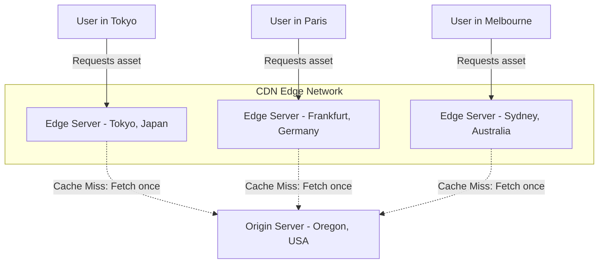

# Content Delivery Network (CDN)

A Content Delivery Network (CDN) is a globally distributed network of proxy servers and data centers. Its primary purpose is to provide high availability and performance by distributing content spatially relative to end users.

---

## The Problem It Solves

If your application servers (origin servers) are located in Oregon, USA, and a user from Sydney, Australia, requests a static asset (like an image, CSS file, or video), the request must travel across undersea cables:

```
[ User in Sydney ] <==== (12,000 km Undersea Cable) ====> [ Origin Server in Oregon ]
```

This setup suffers from major limitations:
1. **Geographic Latency:** The physical speed of light in fiber optic cables means requests take upwards of 200–300 milliseconds just to travel back and forth (Round Trip Time or RTT). This results in a sluggish loading experience.
2. **Origin Server Congestion:** The origin server must process every single request for images, JS, CSS, and HTML. Under heavy traffic, static asset downloads exhaust network bandwidth and connection limits on the origin server.
3. **High Bandwidth Costs:** Serving gigabytes or terabytes of static media directly from cloud providers (AWS, GCP) is highly expensive.

---

## The Solution

CDNs place caching servers (called Edge Servers or Point of Presence - PoP) at the "edges" of the internet, physically closer to major population hubs.



When a user requests a file:
1. **Anycast/DNS Routing:** The user's browser DNS request resolves to the IP address of the closest CDN Edge Server (PoP) instead of the origin server.
2. **Edge Caching:** If the Edge Server has the file (Cache Hit), it serves it immediately to the user (reducing latency to 10–20ms).
3. **Origin Fetching:** If the Edge Server doesn't have the file (Cache Miss), it fetches it from the origin server, returns it to the user, and caches it locally for future requests.

---

## Real-World Example

Imagine a global publishing house that prints a weekly magazine.

* **Without a CDN:** The publishing house is located in New York. If a reader in London, Paris, or Tokyo wants to buy the magazine, they must order it from New York. Each copy is shipped individually across the ocean, taking days to arrive and costing a high shipping fee.
* **With a CDN:** The publishing house partners with local newsstands (Edge Servers) in London, Paris, and Tokyo. Every Monday, the publisher ships one master copy (or prints locally) to each newsstand. When local readers want the magazine, they walk to their local newsstand and buy it instantly.

---

## Push vs. Pull CDNs

CDNs can be configured in two main ways depending on how content is populated to the Edge Servers:

### 1. Pull CDNs (Origin Pull)
The CDN edge servers act reactively. 
* **How it works:** When a client requests a resource, the CDN checks its cache. If it is a cache miss, the CDN pulls the resource from the origin server, stores it, and returns it to the user.
* **Best for:** Websites with high traffic and frequently changing, smaller files (like HTML, CSS, JS, and product images).
* **Pros:** Minimal setup; automatically caches what is popular; saves CDN storage space.

### 2. Push CDNs
The application server proactively pushes content to the CDN storage before anyone asks for it.
* **How it works:** When you build or deploy your app, your CI/CD pipeline uploads static assets directly to the CDN.
* **Best for:** Large, infrequently changing media files (like software installers, video files, and game patches).
* **Pros:** Content is always pre-warmed and immediately available at the edge (no slow first load).
* **Cons:** Storage costs can be higher because you push everything, even files that might never be requested.

---

## Static vs. Dynamic Caching

Modern CDNs do more than just cache static images and files:

* **Static Caching:** Caching CSS, JS, images, fonts, and video segments.
* **Dynamic Acceleration (Routing Optimization):** CDNs cannot cache personalized dynamic content (e.g., user dashboards, shopping carts), but they can speed up the connection. CDNs use optimized network routing between their Edge servers and the origin server (using TCP connection reuse, HTTP/2 multiplexing, and routing algorithms) to make dynamic API calls faster.
* **Edge Compute (Cloudflare Workers, AWS Lambda@Edge):** Running lightweight serverless code directly on the Edge servers to perform authorization, A/B testing, header modification, and geolocation routing without ever hitting the origin server.

---

> [!IMPORTANT]
> **CDN Cache Invalidation (Purging):** If you deploy a new version of your website and change `app.js`, but the CDN still has the old version cached with a long TTL, users will see a broken or old website. To resolve this, use **Cache Busting** (e.g., naming your file `app.a8f9c2.js` using a build hash) or perform a manual **CDN Cache Purge** during deployment.
