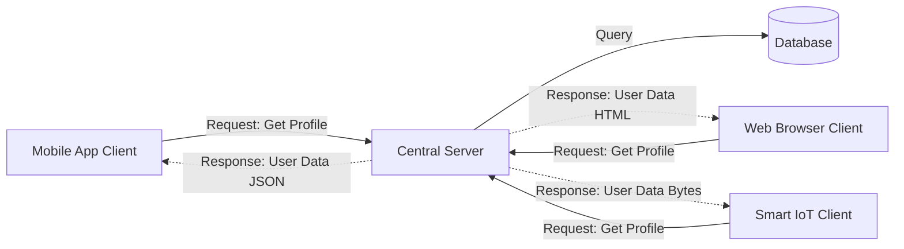

# Client-Server Model

The client-server model is a distributed application structure that partitions tasks or workloads between the providers of a resource or service (called **servers**) and service requesters (called **clients**).

---

## The Problem It Solves

If every computer had to store all its own data and compute its own complex operations locally, we would run into massive limitations:
* **Storage and Compute Limits:** Mobile phones and personal laptops have limited storage and processing power. They cannot host petabytes of global search indexes or run heavy database search algorithms locally.
* **Data Desynchronization:** If database tables are stored locally on each user's computer, sharing data (like a chat message or a banking balance) becomes impossible to coordinate in real time.
* **Security Risks:** Storing sensitive logic (like payment verification or user passwords) on a user's machine exposes it to tampering and reverse engineering.

---

## The Solution

By centralizing data, storage, and heavy calculations on high-powered, secured machines (**servers**), we can build lightweight, low-power applications on user devices (**clients**) that connect to the servers over a network to retrieve and send data.

* **Client (Requestor):** Initiates a request to the server, formats the presentation of the response, and manages user interaction. Examples include Chrome, iOS apps, gaming clients, or curl commands.
* **Server (Provider):** Waits for incoming requests from clients, performs business calculations, queries the database, and returns the response. Servers are typically high-performance machines running indefinitely.

---

## Real-World Example

Think of visiting a restaurant to eat.

* **The Customer (Client):** Sits at the table, views the menu, and makes a request (e.g., "I want a steak"). The customer does not have cooking equipment at their table, does not store the meat, and does not need to know how to cook a steak.
* **The Kitchen (Server):** Receives the request from the customer. The kitchen has the high-powered stove, the ingredients, and the chef. They process the request (cook the steak) and send the food back to the customer's table.

---

## Thin Clients vs. Thick Clients

Clients are classified by how much processing they perform locally:

| Client Type | Description | Pros | Cons |
| :--- | :--- | :--- | :--- |
| **Thin Client** | Performs minimal processing. It relies heavily on the server to do the work and just displays the visual output (e.g., standard HTML/CSS websites, Remote Desktop, streaming services like Stadia/GeForce Now). | Very low hardware requirements for users; easy to update because logic resides on the server. | Requires a constant, fast internet connection; server can become easily overloaded. |
| **Thick (Fat) Client** | Performs a significant amount of data processing and business logic locally (e.g., modern Single Page Apps like React/Vue apps, native desktop software, video games). | Works offline or in poor network conditions; reduces server load; provides high-responsiveness. | High user device hardware requirements; harder to distribute updates (e.g., app store approval processes). |

---

## Key Concepts

### 1. Request-Response Cycle
Communication in this model is client-initiated. The server waits silently. The client opens a connection, sends a request (headers, method, body), the server processes it, sends a response (status code, body), and the connection is closed or kept alive for future requests.

### 2. Statelessness
In modern RESTful client-server setups, communication is designed to be **stateless**. The server does not store client session context. Instead, the client must include all necessary information (like authorization tokens) in every request. This makes it trivial to load-balance requests across multiple servers.

---

## Strengths & Weaknesses

### Advantages
* **Centralization:** Data is stored in one secure place, making backups, updates, and consistency management straightforward.
* **Security:** Access control, encryption, and validation are enforced on the server where clients cannot tamper with the code.
* **Scalability:** You can scale server hardware or add more servers to handle increased traffic without forcing clients to buy faster devices.

### Disadvantages
* **Single Point of Congestion:** The server can become a bottleneck if too many clients request resources simultaneously (leading to DDoS or server crashes).
* **Network Dependency:** If the network is down or the server is unavailable, the client application is usually non-functional.
