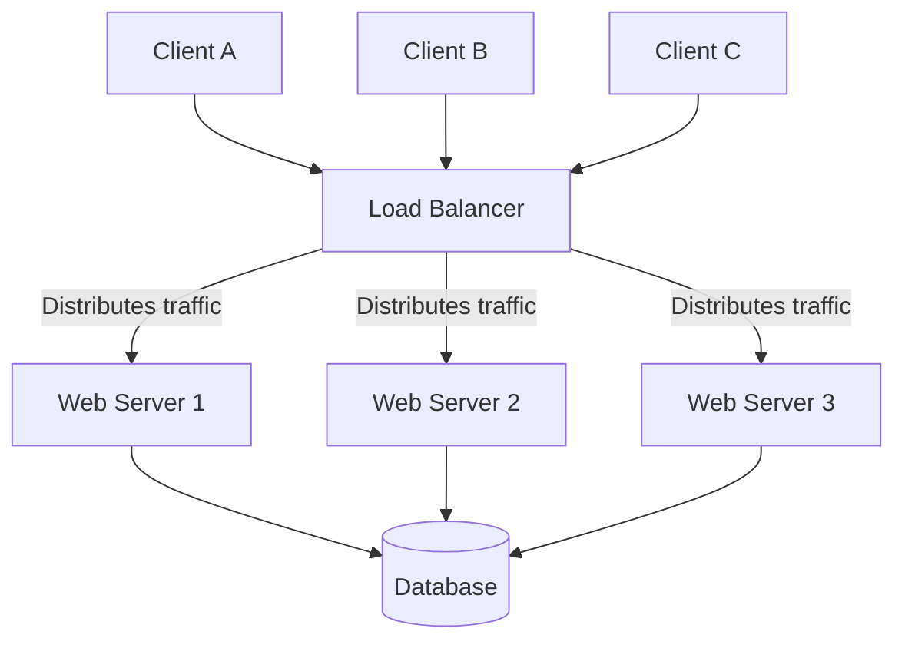

# Load Balancers

A load balancer acts as a traffic cop sitting in front of your servers and routing client requests across all servers capable of fulfilling those requests in a manner that maximizes speed and capacity utilization. It ensures that no single server bears too much demand, which could degrade performance or cause the server to crash.

---

## The Problem It Solves

Without a load balancer, a typical application setup connects clients directly to a single application server:

```
[ Clients ] --------> [ Single Web Server ] --------> [ Database ]
```

This architecture introduces critical vulnerabilities:

1. **Single Point of Failure (SPOF):** If the single web server goes down (due to hardware failure, software crash, or maintenance), the entire application becomes completely unavailable.
2. **Server Overload:** As traffic spikes, the single server will eventually exhaust its CPU, memory, or network bandwidth, leading to slow response times, dropped connections, and crashes.
3. **Scaling Limitations:** You can only scale the server vertically (adding more CPU/RAM), which has physical and cost limits. You cannot easily perform horizontal scaling (adding more servers).

---

## The Solution

A Load Balancer enables horizontal scaling by distributing incoming requests across a pool of multiple servers (often called a server farm or backend pool).



By placing a load balancer in front of a server pool, you achieve:
* **High Availability:** If a server fails, the load balancer redirects traffic to the remaining healthy servers.
* **Scalability:** You can easily add or remove servers from the pool without interrupting the user experience.
* **Redundancy:** Maintenance can be performed on individual servers by taking them out of the load balancer pool one at a time (rolling deployments).

---

## Real-World Example

Imagine a popular supermarket on a busy weekend. 

* **Without a Load Balancer (Single Server):** There is only one cash register open. As shoppers line up, the queue grows longer. The cashier gets stressed and works slower, and some customers leave in frustration. If the cashier needs a break, the checkout line stops completely.
* **With a Load Balancer:** The supermarket opens ten cash registers and employs a queue manager at the front. The manager (the load balancer) directs each customer (request) to the cash register (server) with the shortest line or the next available cashier. If one cashier goes on break, the manager simply routes customers to the other nine cashiers.

---

## Key Concepts

### 1. Health Checks
To prevent routing traffic to a crashed or unhealthy server, load balances periodically test backend servers (e.g., sending an HTTP request to `/health`). If a server fails the health check, the load balancer removes it from the active pool until it starts responding successfully again.

### 2. Layer 4 vs. Layer 7 Load Balancing
Load balancers operate at different layers of the OSI model:

| Type | OSI Layer | Routing Decision Basis | Performance | Use Case |
| :--- | :--- | :--- | :--- | :--- |
| **Layer 4 (L4)** | Transport (TCP/UDP) | IP Addresses and Ports. It does not inspect the content of the packets. | Extremely fast (low CPU overhead) | Simple packet routing, database connection pools, high-throughput network streaming. |
| **Layer 7 (L7)** | Application (HTTP/HTTPS) | Content of the request (URL paths, HTTP headers, cookies, query parameters). | Slower (requires parsing the application data) | Smart routing, SSL termination, path-based routing (e.g., `/api` goes to API server, `/static` goes to storage). |

### 3. Load Balancing Algorithms

* **Round Robin:** Passes each new request to the next server in line sequentially. Best when all backend servers have equal capacity.
* **Least Connections:** Routes traffic to the server with the fewest active connections. Recommended when request processing times vary significantly.
* **IP Hash:** Computes a hash of the client's IP address to determine which server receives the request. This ensures a specific client always hits the same server (session persistence).
* **Weighted Round Robin / Weighted Least Connections:** Assigns a weight to each server based on its hardware capacity. Servers with higher weights receive more traffic.

---

> [!TIP]
> When designing high-availability systems, the Load Balancer itself can become a Single Point of Failure. To prevent this, architects deploy load balancers in an **Active-Passive pair** using a shared Virtual IP (VIP). If the active load balancer fails, the passive one instantly takes over using Keepalived or similar heartbeating protocols.
