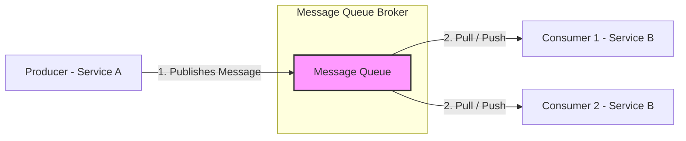

# Message Queues

A message queue is a form of asynchronous service-to-service communication used in serverless and microservices architectures. Messages are stored on the queue until they are processed and deleted by a consuming service.

---

## The Problem It Solves

In synchronous system designs (where services call each other directly via HTTP/gRPC), services are tightly coupled, leading to several weaknesses:
* **System Cascading Failures:** If Service A calls Service B, and Service B goes down, Service A fails too. The failure cascades up the stack to the user.
* **Request Blocking and Latency:** If a user performs an action that triggers multiple long-running tasks (e.g., uploading a photo, sending confirmation emails, generating PDF receipts), they must wait for all tasks to complete before receiving a response.
* **Traffic Spikes (Overwhelm):** A sudden surge of requests (e.g., Black Friday shopping) can overwhelm downstream services, causing databases to crash due to too many open connections.

---

## The Solution

A message queue decouples services by acting as an asynchronous buffer. Service A (the Producer) sends a message to the queue and immediately returns a success status to the user. Service B (the Consumer) processes the message from the queue whenever it has the capacity.

By introducing message queues, you achieve:
* **Asynchronous Decoupling:** Producers do not need to know who the consumers are or if they are currently online.
* **Spike Buffering (Rate Limiting):** The queue stores messages safely during traffic spikes, letting consumers process them at their own steady pace without crashing.
* **Improved User Latency:** Long-running operations are offloaded to background workers, returning immediate responses to users.

---

## Real-World Example

Imagine ordering coffee at a busy cafe.

* **Without a Queue (Synchronous):** The barista takes your order, walks over to brew the coffee, pours it, hands it to you, and only *then* takes the next customer's order. If there are 20 people in line, the process is extremely slow, and if the coffee machine breaks, the cashier cannot take any more orders.
* **With a Queue:** The cashier takes your order, prints a ticket (the message), drops it onto a ticket spindle (the queue), and immediately serves the next customer. Baristas (consumers) pull tickets off the spindle one by one and make the coffee. If the coffee machine breaks, the cashier can still take orders and pile up tickets; the orders are safe on the spindle until the machine is fixed.

---

## Key Patterns

### 1. Point-to-Point (Queue)
Each message in the queue is consumed by **exactly one** consumer. Once a consumer processes a message, it is deleted from the queue.
* **Use Case:** Task distribution and worker queues (e.g., processing video files).

### 2. Publish-Subscribe (Pub/Sub)
Messages are published to a "topic" and are broadcasted to **all** active subscribers. Each subscriber receives its own copy of the message.
* **Use Case:** Event-driven systems. For example, when an order is created, the Billing, Shipping, and Analytics services all receive the event simultaneously to perform their respective tasks.

---

## Delivery Semantics

How message brokers guarantee message delivery:

* **At-Most-Once:** Messages are delivered once and forgotten. If a consumer crashes while processing, the message is lost. (Fastest, lowest reliability).
* **At-Least-Once:** Messages are guaranteed to be delivered, but duplicates may occur if the network fails during acknowledgment. The consumer *must* be **idempotent** (capable of processing the same message multiple times without side effects).
* **Exactly-Once:** Messages are guaranteed to be delivered and processed exactly once. This is the hardest semantic to achieve and incurs high performance overhead (e.g., Kafka transactions).

---

> [!NOTE]
> **Popular Message Queue Systems:**
> * **RabbitMQ:** Best for complex routing, point-to-point queues, and AMQP protocol features.
> * **Apache Kafka:** Designed for high-throughput stream processing, log replication, and massive event history storage.
> * **AWS SQS:** A fully managed, simple queue service with minimal operational overhead.
