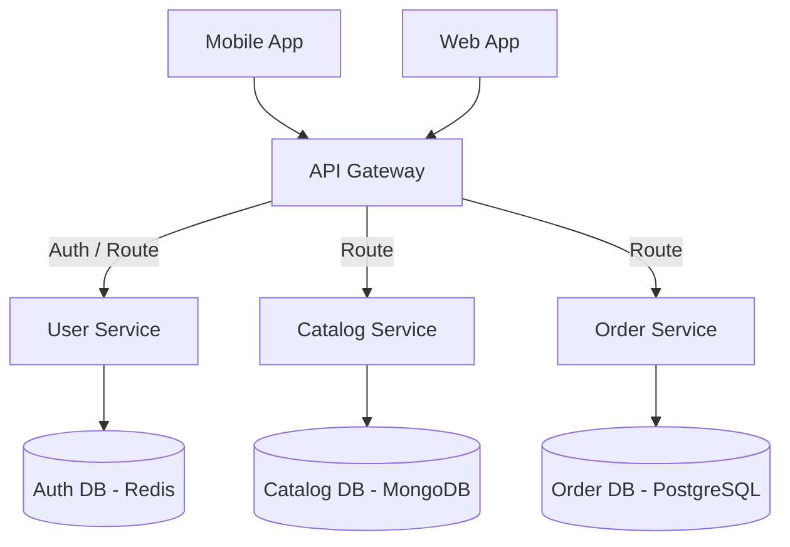

# Microservices Architecture

A microservices architecture structures an application as a collection of small, autonomous services. Each service is highly maintainable, loosely coupled, independently deployable, and organized around specific business capabilities.

---

## The Problem It Solves

As monolithic applications grow, they run into significant bottlenecks:
* **Deployment Bottlenecks:** A small change in a minor feature requires rebuilding and redeploying the entire monolith, leading to high-risk, slow release cycles.
* **Organizational Scaling Issues:** When hundreds of developers work on a single codebase, they frequently step on each other's toes (merge conflicts, conflicting database schema changes).
* **Scaling Inefficiency:** If one part of the app is highly resource-intensive (e.g., video transcoding), the entire monolith must be duplicated across multiple servers, wasting CPU and RAM on unused services.
* **Lack of Tech Flexibility:** The entire monolith must use the same language and database, making it hard to adopt better tools for specialized tasks.

---

## The Solution

By breaking the application down into independent services that communicate over lightweight network protocols (HTTP APIs, gRPC, or message brokers), teams can develop, scale, and deploy each service independently.

### Core Characteristics
1. **Decentralized Data:** Each microservice owns its database. Service A cannot query Service B's database directly; it must request data via Service B's API. This prevents database schema changes in one service from breaking others.
2. **API Gateway:** A single entry point for clients that routes requests, handles authentication, and optionally aggregates responses from multiple services.
3. **Independent Deployments:** Teams can push updates to the Catalog Service without impacting the Order Service or requiring a system-wide release.

---

## Real-World Example

Think of an airport operations model.

* **Monolithic Approach:** One giant control room makes every single decision—from ticketing and baggage handling to plane maintenance and piloting. If the baggage system jams, the entire airport shuts down because the unified system crashes.
* **Microservices Approach:** The airport is divided into independent teams. The Baggage Team, the Security Team, the Ticketing Team, and the Pilots operate autonomously. They communicate via walkie-talkies (APIs/Network protocols) using standard codes. If the baggage system jams, people still check in, planes still land, and security still functions. The system is resilient.

---

## Microservice Communication

Services must talk to each other to fulfill complex requests. There are two primary patterns:

### 1. Synchronous Communication (e.g., HTTP REST, gRPC)
* **How it works:** Service A calls Service B and blocks (waits) until Service B responds.
* **Use Case:** Fetching real-time stock availability during checkout.
* **Risk:** Cascading failures. If Service B is slow or down, Service A hangs, which can crash the entire call chain.

### 2. Asynchronous Communication (e.g., RabbitMQ, Kafka)
* **How it works:** Service A publishes an event to a message broker (e.g., `order-created`). Service B listens to the broker, receives the event, and processes it in the background. Service A does not wait for a response.
* **Use Case:** Triggering invoice emails or shipping notifications after a successful order.
* **Benefit:** High decoupling and resilience. If the email service is down, the message stays in the queue until it recovers.

---

## Strengths & Weaknesses

### Advantages
* **Independent Scalability:** Scale only the services that have high load (e.g., scale the Auth service during peak login times).
* **Faster Time-to-Market:** Independent pipelines allow teams to deploy updates daily without coordinating with other teams.
* **Fault Isolation:** If the recommendation service crashes, users can still search and buy products.
* **Technology Diversity:** Use Python for ML services, Go for high-throughput APIs, and Node.js for frontend backends.

### Disadvantages
* **Network Latency & Overhead:** Crossing the network for service-to-service communication is slower than in-memory calls.
* **Complexity:** Operational complexity is massive (requires container orchestration like Kubernetes, service discovery, distributed tracing, and centralized logging).
* **Data Consistency:** Enforcing transactions across multiple databases is difficult, forcing systems to adopt **Eventual Consistency** rather than strong consistency.
