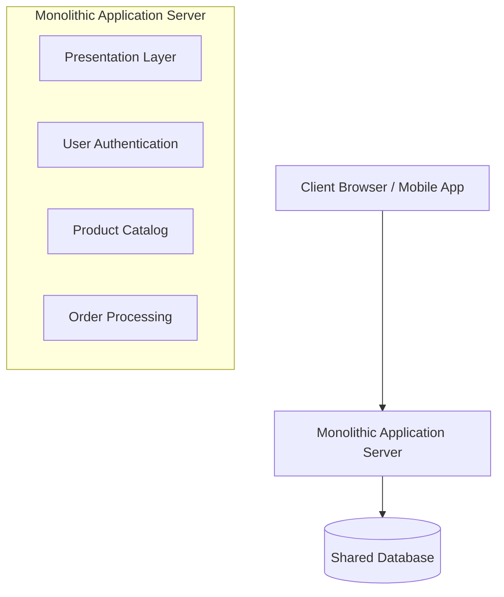

# Monolithic Architecture

A monolithic architecture is a traditional software development model where all components of an application—from the user interface and business logic to data access and database operations—are unified into a single, cohesive codebase and run as a single service.

---

## The Problem It Solves

When starting a new software project, teams need to move quickly, iterate fast, and keep complexity low. A monolithic architecture solves these challenges by:
* **Reducing Deployment Complexity:** Deploying a single build artifact (e.g., one `.war` file, one executable, or a single directory of scripts) is much simpler than managing multiple services.
* **Simplifying Testing & Debugging:** Since all code runs in the same process, developers can easily run the entire system locally, set breakpoints, and trace bugs from the frontend to the backend database.
* **Minimizing Network Latency:** Components communicate using simple in-memory function calls rather than making expensive network calls (HTTP/gRPC) across servers.

---

## The Solution

In a monolith, all business domains (e.g., User Management, Product Catalog, and Order Processing) live in the same repository, share a database, and run together.

* **Cohesive Codebase:** One repository to pull, compile, and run.
* **Cross-Cutting Concerns:** Shared utility libraries, logging, and security modules are easily referenced across all modules.
* **ACID Transactions:** Database operations spanning multiple domains (e.g., updating user balance and updating product stock) are trivial because they share the same database connection and can run in a single transaction.

---

## Real-World Example

Imagine a small local bakery starting a home-delivery service.

* **Monolithic Approach:** The bakery hires one person (the "monolith") who takes the order on the phone, bakes the bread, packages it, and drives the delivery van to the customer. This worker has access to all parts of the shop (shared database) and coordinates everything internally. For a small bakery, this is highly efficient because there is zero communication overhead or coordination delay.
* **Scale Issue:** As orders grow to 1,000 per day, this single person becomes overwhelmed. You cannot scale them easily. If the delivery van breaks down (module crash), the baking and order-taking also stop because the single person is stuck dealing with the van.

---

## Strengths & Weaknesses

### Advantages
1. **Easy to Develop:** Simple to start, trace, and run locally.
2. **Easy to Deploy:** Only one file or container to release to production.
3. **High Performance:** Zero network latency between modules because communication happens in-memory.
4. **Consistency:** Unified database means transactions are simple and data integrity is easy to maintain.

### Disadvantages
1. **Scalability Bottleneck:** You must scale the entire application horizontally even if only one resource-intensive module (like image processing) is bottlenecked.
2. **Coupled Codebase:** As the team grows, merge conflicts increase. Large codebases become hard to understand and refactor.
3. **Single Point of Failure (SPOF):** A bug or memory leak in one module (e.g., a bad loops in the Catalog service) can crash the entire application process, taking down unrelated features like User Auth.
4. **Technology Lock-in:** It is extremely difficult to adopt new languages or frameworks, as the entire system is bound to the stack selected at the project's inception.

---

> [!TIP]
> **Modular Monoliths:** Before jumping into microservices, consider a Modular Monolith. This is an architecture where code is strictly organized into independent, decoupled packages or modules with clear interfaces, but still deployed together as a single executable and database. This provides separation of concerns without the network and operational overhead of microservices.
