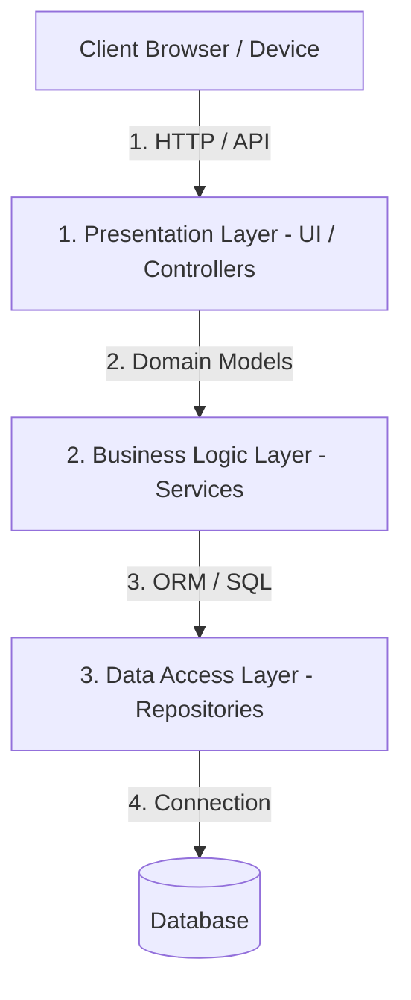

# Tiered (Layered) Architecture

Tiered (or Layered) Architecture is a standard architectural pattern where software components are organized into horizontal layers. Each layer has a specific role and responsibility, and layers communicate only with those immediately adjacent to them.

---

## The Problem It Solves

In poorly structured applications, database queries, business rules, and HTML rendering are often mixed together in the same files (spaghetti code). This leads to:
* **High Maintenance Cost:** Changing a database column requires modifying UI components and business logic, because they are tightly coupled.
* **Low Testability:** You cannot test business logic (e.g., pricing rules) without also triggering UI code or actual database queries.
* **Lack of Reusability:** If you want to add a mobile app client, you have to rewrite the business logic because it is baked directly into the web UI rendering code.

---

## The Solution

By partitioning the system into distinct layers, you enforce a strict separation of concerns. The most common variation is the **3-Tier Architecture**:

### The Horizontal Layers

1. **Presentation Layer (UI/Client):** Responsible for presenting data to the user and capturing user interactions. This includes HTML/CSS, React components, or REST controllers that parse incoming JSON requests.
2. **Business Logic Layer (Application/Service):** The core of the system. It processes business rules, validations, and workflows (e.g., calculating tax, authorizing payments). It has no knowledge of how data is stored or how it is displayed.
3. **Data Access Layer (Persistence):** Interacts with the database, cache, or external APIs to read and write data. This is typically implemented using repositories, DAOs, or Object-Relational Mappers (ORMs).

---

## Real-World Example

Think of ordering food at a dine-in restaurant.

* **Presentation Layer (The Waiter):** Takes your order, formats it neatly on a ticket, and brings the final plate to your table. The waiter does not cook the food or buy the ingredients.
* **Business Logic Layer (The Chef):** Receives the ticket from the waiter. The chef decides *how* to cook the food (business logic). The chef does not talk to the customers directly or go to the farm to fetch potatoes.
* **Data Access Layer (The Pantry Manager):** The chef asks for ingredients. The pantry manager (repository) retrieves the ingredients from the fridge or cellar (database) and hands them to the chef.

---

## Key Concepts

### 1. Closed vs. Open Layers
* **Closed Layers (Standard):** A layer can only access the layer directly below it. For example, the Presentation layer must go through the Business Logic layer to get data; it cannot query the Data Access layer directly. This ensures strict decoupling.
* **Open Layers:** A layer can bypass the layer immediately below it. While this can reduce boilerplate code for simple read operations, it introduces tight coupling and makes refactoring harder.

### 2. Tier vs. Layer
* **Layers:** logical separation of code (e.g., classes, namespaces, folders in a single project).
* **Tiers:** physical separation of execution environments (e.g., Presentation runs on the user's browser, Business Logic runs on an application server, and the database runs on a dedicated database cluster).

---

## Strengths & Weaknesses

### Advantages
* **Maintainability:** Because components are decoupled, you can rewrite the Data Access layer (e.g., moving from MySQL to PostgreSQL) without changing a single line of code in the Presentation layer.
* **Testability:** You can mock the Data Access layer to unit test the Business Logic layer in isolation.
* **Security:** The database is isolated; clients can only query data through APIs guarded by business logic validation rules.

### Disadvantages
* **Sinkhole Effect:** Requests often pass through multiple layers doing nothing but forwarding arguments, creating boilerplate code.
* **Performance Overhead:** Extra layers of abstraction and serialization/deserialization between tiers can add latency.
* **Scalability Limits:** Since tiers are horizontal, scaling still requires replicating the entire application tier.
